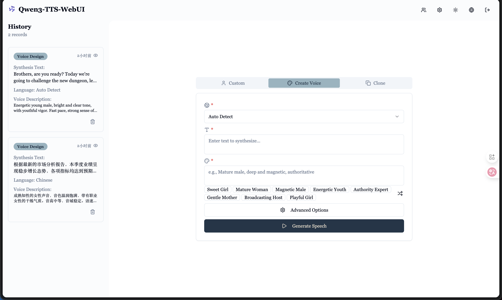
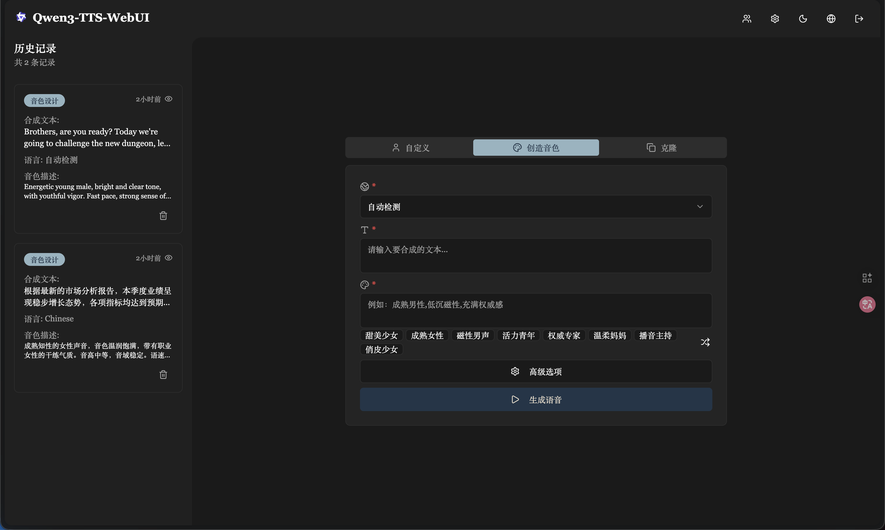
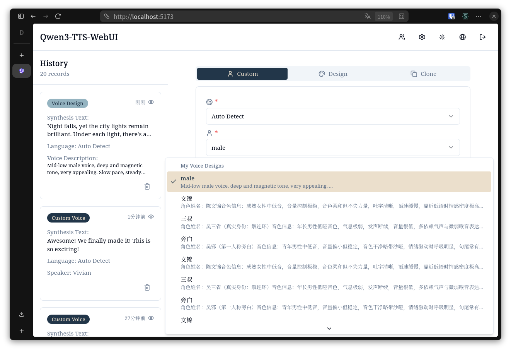
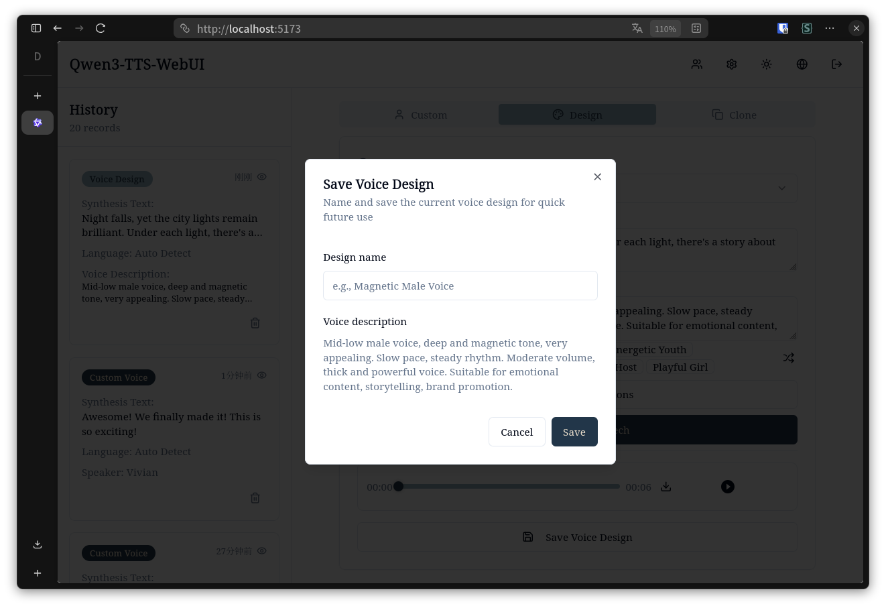
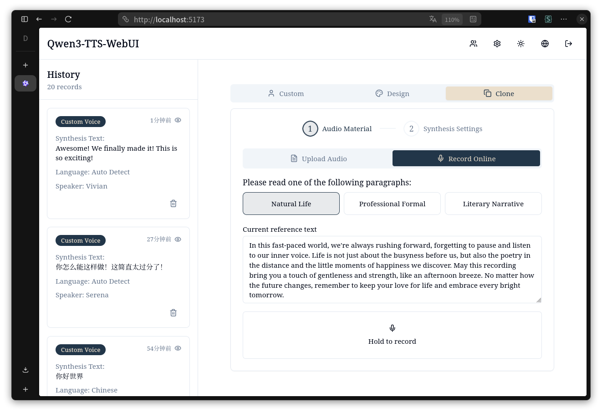
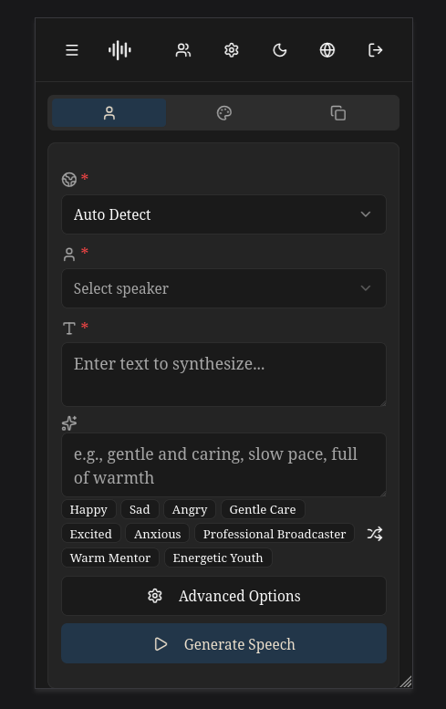
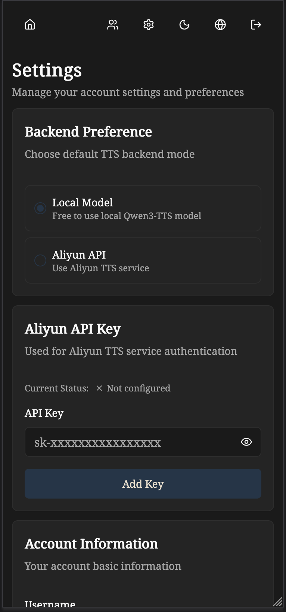
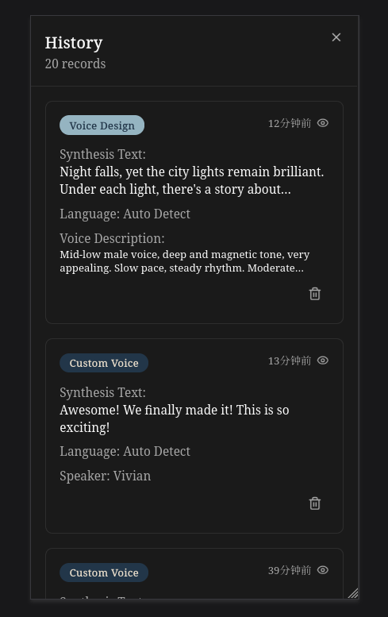

# Qwen3-TTS WebUI

基于 Qwen3-TTS 的文本转语音 Web 应用，支持自定义语音、语音设计和语音克隆。

[English Documentation](./README.md)

## 功能特性

- 自定义语音：预定义说话人语音
- 语音设计：自然语言描述创建语音
- 语音克隆：上传音频克隆语音
- 双后端支持：支持本地模型和阿里云 TTS API 切换
- 多语言支持：English、简体中文、繁體中文、日本語、한국어
- JWT 认证、异步任务、语音缓存、暗黑模式

## 界面预览

### 桌面端 - 亮色模式


### 桌面端 - 暗黑模式


### 桌面端 - 语音设计列表


### 桌面端 - 保存语音设计对话框


### 桌面端 - 语音克隆


### 移动端 - 亮色与暗黑模式
<table>
  <tr>
    <td width="50%"></td>
    <td width="50%"></td>
  </tr>
</table>

### 移动端 - 设置与历史记录
<table>
  <tr>
    <td width="50%"></td>
    <td width="50%"></td>
  </tr>
</table>

## 技术栈

后端：FastAPI + SQLAlchemy + PyTorch + JWT
前端：React 19 + TypeScript + Vite + Tailwind + Shadcn/ui

## 快速开始

### 后端

```bash
cd qwen3-tts-backend
python -m venv venv
source venv/bin/activate
pip install -r requirements.txt
cp .env.example .env
# 编辑 .env 配置 MODEL_BASE_PATH 和 DEFAULT_BACKEND
# 本地模型：确保 MODEL_BASE_PATH 指向 Qwen 模型目录
# 阿里云：设置 DEFAULT_BACKEND=aliyun 并在 Web 设置页面配置 API 密钥
uvicorn main:app --host 0.0.0.0 --port 8000 --reload
```

### 前端

```bash
cd qwen3-tts-frontend
npm install
cp .env.example .env
# 编辑 .env 配置 VITE_API_URL
npm run dev
```

访问 `http://localhost:5173`

**首次运行**: 第一次运行时会自动初始化一个超级管理员账户：
- 用户名：`admin`
- 密码：`admin123456`
- **重要**: 强烈建议登录后立刻修改密码！

## 配置

### 后端配置

后端 `.env` 关键配置：

```env
SECRET_KEY=your-secret-key
MODEL_DEVICE=cuda:0
MODEL_BASE_PATH=../Qwen
DATABASE_URL=sqlite:///./qwen_tts.db

DEFAULT_BACKEND=local

ALIYUN_REGION=beijing
ALIYUN_MODEL_FLASH=qwen3-tts-flash-realtime
ALIYUN_MODEL_VC=qwen3-tts-vc-realtime-2026-01-15
ALIYUN_MODEL_VD=qwen3-tts-vd-realtime-2026-01-15
```

**后端选项：**

- `DEFAULT_BACKEND`: 默认 TTS 后端，可选值：`local` 或 `aliyun`
- **本地模式**: 使用本地 Qwen3-TTS 模型（需要配置 `MODEL_BASE_PATH`）
- **阿里云模式**: 使用阿里云 TTS API（需要用户在设置页面配置 API 密钥）

**阿里云配置：**

- 用户需要在 Web 界面的设置页面添加阿里云 API 密钥
- API 密钥经过加密后安全存储在数据库中
- 超级管理员可以控制是否为所有用户启用本地模型
- 获取阿里云 API 密钥，请访问 [阿里云控制台](https://dashscope.console.aliyun.com/)

### 前端配置

前端 `.env`：

```env
VITE_API_URL=http://localhost:8000
```

## 使用说明

### 切换后端

1. 登录 Web 界面
2. 进入设置页面
3. 配置您偏好的后端：
   - **本地模型**：选择"本地模型"（需要超级管理员启用本地模型）
   - **阿里云 API**：选择"阿里云"并添加您的 API 密钥
4. 选择的后端将默认用于所有 TTS 操作
5. 也可以通过 API 的 `backend` 参数为单次请求指定不同的后端

### 管理阿里云 API 密钥

1. 在设置页面找到"阿里云 API 密钥"部分
2. 输入您的阿里云 API 密钥
3. 点击"更新密钥"保存并验证
4. 系统会在保存前验证密钥的有效性
5. 可随时使用删除按钮删除密钥

## API

```
POST /auth/register          - 注册
POST /auth/token             - 登录
POST /tts/custom-voice       - 自定义语音（支持 backend 参数）
POST /tts/voice-design       - 语音设计（支持 backend 参数）
POST /tts/voice-clone        - 语音克隆（支持 backend 参数）
GET  /jobs                   - 任务列表
GET  /jobs/{id}/download     - 下载结果
```

**Backend 参数：**

所有 TTS 接口都支持可选的 `backend` 参数来指定使用的 TTS 后端：
- `backend: "local"` - 使用本地 Qwen3-TTS 模型
- `backend: "aliyun"` - 使用阿里云 TTS API
- 如果不指定，则使用用户的默认后端设置

## 许可证

Apache-2.0 license 
