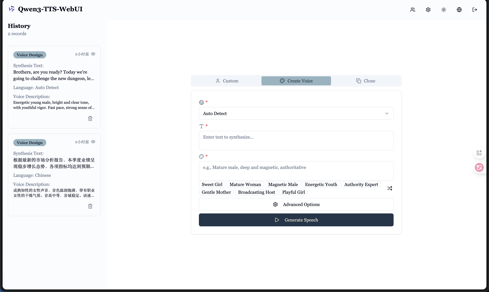
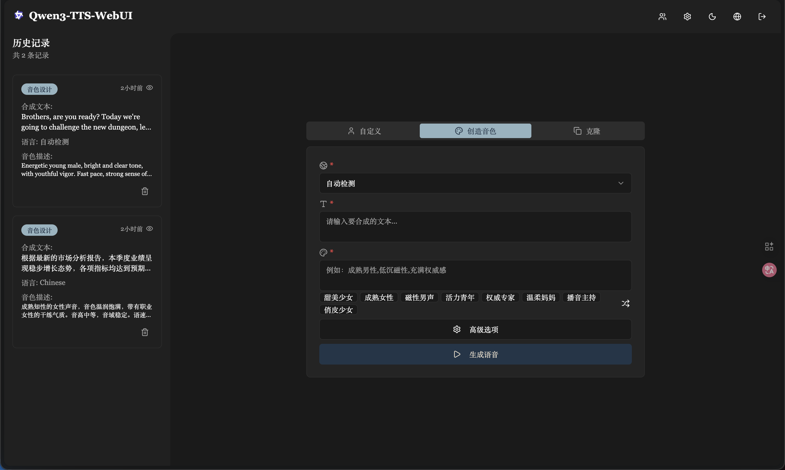
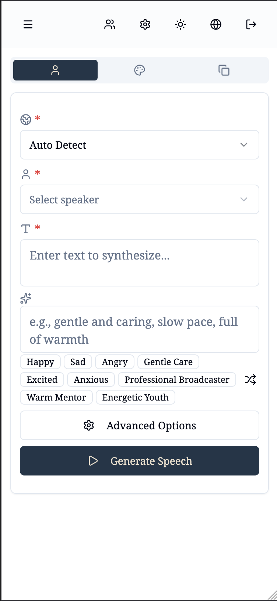
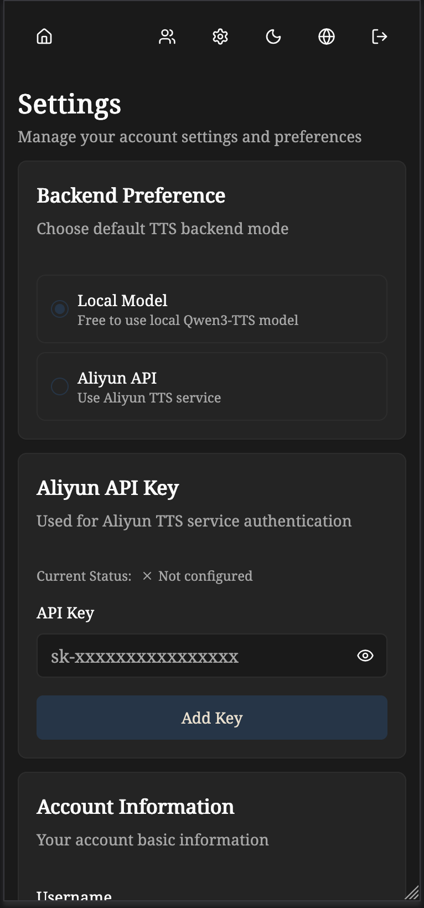
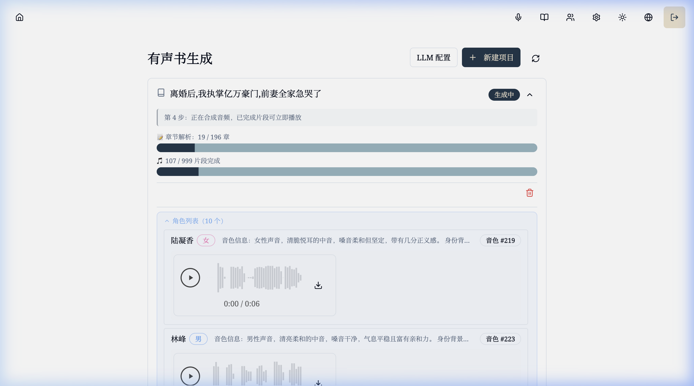
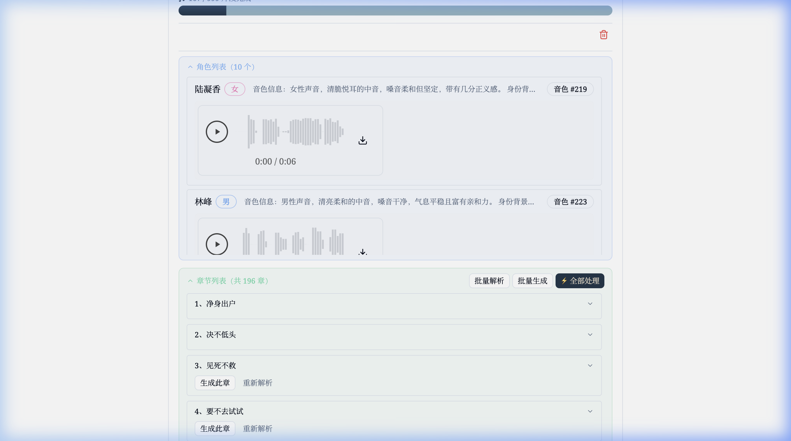
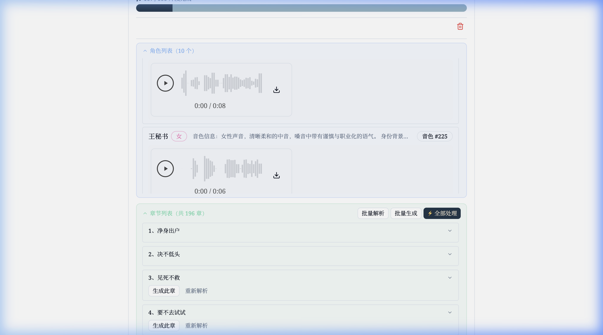

# Qwen3-TTS WebUI

> **⚠️ 注意：** 本项目由大量 AI 生成，目前处于不稳定状态。稳定版将在 [Releases](../../releases) 中发布。

> **🚫 开源版本停止更新：** 本项目开源版本已停止更新，后续将进行闭源开发。目前闭源版本已经可以做到针对台词的情绪控制，并且新增了 NSFW 功能。对有声书感兴趣的欢迎私信联系我合作。

**非官方** 基于 Qwen3-TTS 的文本转语音 Web 应用，支持自定义语音、语音设计和语音克隆，提供直观的 Web 界面。

> 这是一个非官方项目。如需查看官方 Qwen3-TTS 仓库，请访问 [QwenLM/Qwen3-TTS](https://github.com/QwenLM/Qwen3-TTS)。

[English Documentation](./README.md)

## 功能特性

- 自定义语音：预定义说话人语音
- 语音设计：自然语言描述创建语音
- 语音克隆：上传音频克隆语音
- 有声书生成：上传 EPUB 文件，通过 LLM 自动提取角色并分配语音，生成多角色有声书
- 双后端支持：支持本地模型和阿里云 TTS API 切换
- 多语言支持：English、简体中文、繁體中文、日本語、한국어
- JWT 认证、异步任务、语音缓存、暗黑模式

## 界面预览

### 桌面端 - 亮色模式


### 桌面端 - 暗黑模式


### 移动端
<table>
  <tr>
    <td width="50%"></td>
    <td width="50%"></td>
  </tr>
</table>

### 有声书生成


<table>
  <tr>
    <td width="50%"></td>
    <td width="50%"></td>
  </tr>
</table>

## 技术栈

**后端**: FastAPI + SQLAlchemy + PyTorch + JWT
- 使用 PyTorch 直接推理 Qwen3-TTS 模型
- 异步任务处理与批量优化
- 支持本地模型 + 阿里云 API 双后端

**前端**: React 19 + TypeScript + Vite + Tailwind + Shadcn/ui

## Docker 部署

预构建镜像已发布至 Docker Hub：[bdim404/qwen3-tts-backend](https://hub.docker.com/r/bdim404/qwen3-tts-backend)、[bdim404/qwen3-tts-frontend](https://hub.docker.com/r/bdim404/qwen3-tts-frontend)

**前置要求**：Docker、Docker Compose、NVIDIA GPU + [NVIDIA Container Toolkit](https://docs.nvidia.com/datacenter/cloud-native/container-toolkit/install-guide.html)

```bash
git clone https://github.com/bdim404/Qwen3-TTS-WebUI.git
cd Qwen3-TTS-webUI

# 下载模型到 docker/models/（参见下方"安装部署 > 下载模型"）
mkdir -p docker/models docker/data

# 配置
cp docker/.env.example docker/.env
# 编辑 docker/.env，设置 SECRET_KEY

cd docker

# 拉取预构建镜像
docker compose pull

# 启动（仅 CPU）
docker compose up -d

# 启动（GPU 加速）
docker compose -f docker-compose.yml -f docker-compose.gpu.yml up -d
```

访问 `http://localhost`，默认账号：`admin` / `admin123456`

## 安装部署

### 环境要求

- Python 3.9+ 并支持 CUDA（用于本地模型推理）
- Node.js 18+（用于前端）
- Git

### 1. 克隆仓库

```bash
git clone https://github.com/bdim404/Qwen3-TTS-WebUI.git
cd Qwen3-TTS-webUI
```

### 2. 下载模型

**重要**: 模型**不会**自动下载，需要手动下载。

详细信息请访问官方仓库：[Qwen3-TTS 模型](https://github.com/QwenLM/Qwen3-TTS)

进入模型目录：
```bash
# Docker 部署
mkdir -p docker/models && cd docker/models

# 本地部署
cd qwen3-tts-backend && mkdir -p Qwen && cd Qwen
```

**方式一：通过 ModelScope 下载（推荐中国大陆用户）**

```bash
pip install -U modelscope

modelscope download --model Qwen/Qwen3-TTS-Tokenizer-12Hz --local_dir ./Qwen3-TTS-Tokenizer-12Hz
modelscope download --model Qwen/Qwen3-TTS-12Hz-1.7B-CustomVoice --local_dir ./Qwen3-TTS-12Hz-1.7B-CustomVoice
modelscope download --model Qwen/Qwen3-TTS-12Hz-1.7B-VoiceDesign --local_dir ./Qwen3-TTS-12Hz-1.7B-VoiceDesign
modelscope download --model Qwen/Qwen3-TTS-12Hz-1.7B-Base --local_dir ./Qwen3-TTS-12Hz-1.7B-Base
```

可选的 0.6B 模型（更小、更快）：
```bash
modelscope download --model Qwen/Qwen3-TTS-12Hz-0.6B-CustomVoice --local_dir ./Qwen3-TTS-12Hz-0.6B-CustomVoice
modelscope download --model Qwen/Qwen3-TTS-12Hz-0.6B-Base --local_dir ./Qwen3-TTS-12Hz-0.6B-Base
```

**方式二：通过 Hugging Face 下载**

```bash
pip install -U "huggingface_hub[cli]"

hf download Qwen/Qwen3-TTS-Tokenizer-12Hz --local-dir ./Qwen3-TTS-Tokenizer-12Hz
hf download Qwen/Qwen3-TTS-12Hz-1.7B-CustomVoice --local-dir ./Qwen3-TTS-12Hz-1.7B-CustomVoice
hf download Qwen/Qwen3-TTS-12Hz-1.7B-VoiceDesign --local-dir ./Qwen3-TTS-12Hz-1.7B-VoiceDesign
hf download Qwen/Qwen3-TTS-12Hz-1.7B-Base --local-dir ./Qwen3-TTS-12Hz-1.7B-Base
```

可选的 0.6B 模型（更小、更快）：
```bash
hf download Qwen/Qwen3-TTS-12Hz-0.6B-CustomVoice --local-dir ./Qwen3-TTS-12Hz-0.6B-CustomVoice
hf download Qwen/Qwen3-TTS-12Hz-0.6B-Base --local-dir ./Qwen3-TTS-12Hz-0.6B-Base
```

**最终目录结构：**

Docker 部署（`docker/models/`）：
```
Qwen3-TTS-webUI/
└── docker/
    └── models/
        ├── Qwen3-TTS-Tokenizer-12Hz/
        ├── Qwen3-TTS-12Hz-1.7B-CustomVoice/
        ├── Qwen3-TTS-12Hz-1.7B-VoiceDesign/
        └── Qwen3-TTS-12Hz-1.7B-Base/
```

本地部署（`qwen3-tts-backend/Qwen/`）：
```
Qwen3-TTS-webUI/
└── qwen3-tts-backend/
    └── Qwen/
        ├── Qwen3-TTS-Tokenizer-12Hz/
        ├── Qwen3-TTS-12Hz-1.7B-CustomVoice/
        ├── Qwen3-TTS-12Hz-1.7B-VoiceDesign/
        └── Qwen3-TTS-12Hz-1.7B-Base/
```

### 3. 后端配置

```bash
cd qwen3-tts-backend

# 创建虚拟环境
python -m venv venv
source venv/bin/activate  # Windows: venv\Scripts\activate

# 安装依赖
pip install -r requirements.txt

# 安装 Qwen3-TTS
pip install qwen-tts

# 创建配置文件
cp .env.example .env

# 编辑配置文件
# 本地模型：设置 MODEL_BASE_PATH=./Qwen
# 仅阿里云 API：设置 DEFAULT_BACKEND=aliyun
nano .env  # 或使用其他编辑器
```

**重要的后端配置** (`.env` 文件)：
```env
MODEL_DEVICE=cuda:0              # 使用 GPU（或 cpu 使用 CPU）
MODEL_BASE_PATH=./Qwen           # 已下载模型的路径
DEFAULT_BACKEND=local            # 使用本地模型用 'local'，API 用 'aliyun'
DATABASE_URL=sqlite:///./qwen_tts.db
SECRET_KEY=your-secret-key-here  # 请修改此项！
```

启动后端服务：
```bash
# 使用 uvicorn 直接启动
uvicorn main:app --host 0.0.0.0 --port 8000 --reload

# 或使用 conda（如果你喜欢）
conda run -n qwen3-tts uvicorn main:app --host 0.0.0.0 --port 8000 --reload
```

验证后端是否运行：
```bash
curl http://127.0.0.1:8000/health
```

### 4. 前端配置

```bash
cd qwen3-tts-frontend

# 安装依赖
npm install

# 创建配置文件
cp .env.example .env

# 启动开发服务器
npm run dev
```

### 5. 访问应用

在浏览器中打开：`http://localhost:5173`

**默认账号**：
- 用户名：`admin`
- 密码：`admin123456`
- **重要**: 登录后请立即修改密码！

### 生产环境部署

用于生产环境：

```bash
# 后端：使用 gunicorn 或类似的 WSGI 服务器
cd qwen3-tts-backend
gunicorn main:app -w 4 -k uvicorn.workers.UvicornWorker -b 0.0.0.0:8000

# 前端：构建静态文件
cd qwen3-tts-frontend
npm run build
# 使用 nginx 或其他 Web 服务器提供 'dist' 文件夹
```

## 配置

### 后端配置

后端 `.env` 关键配置：

```env
SECRET_KEY=your-secret-key
MODEL_DEVICE=cuda:0
MODEL_BASE_PATH=../Qwen
DATABASE_URL=sqlite:///./qwen_tts.db

DEFAULT_BACKEND=local

ALIYUN_REGION=beijing
ALIYUN_MODEL_FLASH=qwen3-tts-flash-realtime
ALIYUN_MODEL_VC=qwen3-tts-vc-realtime-2026-01-15
ALIYUN_MODEL_VD=qwen3-tts-vd-realtime-2026-01-15
```

**后端选项：**

- `DEFAULT_BACKEND`: 默认 TTS 后端，可选值：`local` 或 `aliyun`
- **本地模式**: 使用本地 Qwen3-TTS 模型（需要配置 `MODEL_BASE_PATH`）
- **阿里云模式**: 使用阿里云 TTS API（需要用户在设置页面配置 API 密钥）

**阿里云配置：**

- 用户需要在 Web 界面的设置页面添加阿里云 API 密钥
- API 密钥经过加密后安全存储在数据库中
- 超级管理员可以控制是否为所有用户启用本地模型
- 获取阿里云 API 密钥，请访问 [阿里云控制台](https://dashscope.console.aliyun.com/)

## 使用说明

### 切换后端

1. 登录 Web 界面
2. 进入设置页面
3. 配置您偏好的后端：
   - **本地模型**：选择"本地模型"（需要超级管理员启用本地模型）
   - **阿里云 API**：选择"阿里云"并添加您的 API 密钥
4. 选择的后端将默认用于所有 TTS 操作
5. 也可以通过 API 的 `backend` 参数为单次请求指定不同的后端

### 管理阿里云 API 密钥

1. 在设置页面找到"阿里云 API 密钥"部分
2. 输入您的阿里云 API 密钥
3. 点击"更新密钥"保存并验证
4. 系统会在保存前验证密钥的有效性
5. 可随时使用删除按钮删除密钥

## 特别鸣谢

本项目基于阿里云 Qwen 团队开源的 [Qwen3-TTS](https://github.com/QwenLM/Qwen3-TTS) 官方仓库构建。特别感谢 Qwen 团队开源如此强大的文本转语音模型。

## 许可证

Apache-2.0 license 
