# Qwen3-TTS 多人对话功能设计文档

> 基于 requirements.md 需求文档，通过详细讨论确定的技术设计方案

## 目录

- [1. 数据模型设计](#1-数据模型设计)
- [2. API 接口设计](#2-api-接口设计)
- [3. 前端架构设计](#3-前端架构设计)
- [4. 核心功能流程](#4-核心功能流程)
- [5. 技术实现细节](#5-技术实现细节)
- [6. 配置和环境变量](#6-配置和环境变量)
- [7. 验收标准](#7-验收标准)

---

## 1. 数据模型设计

### 1.1 VoiceLibrary（音色库）

音色库用于持久化存储用户创建的音色配置。

```python
class VoiceLibrary(Base):
    __tablename__ = "voice_libraries"

    id: int                        # 主键
    user_id: int                   # 外键 -> User.id
    name: str                      # 音色名称
    description: str               # 音色描述（可选，nullable）
    voice_type: str                # 音色类型: "custom_voice" | "voice_design" | "voice_clone"
    voice_data: dict               # JSON，存储类型特定参数
    tags: list[str]                # JSON 数组，标签列表
    preview_audio_path: str        # 示例音频路径（可选，nullable）
    created_at: datetime           # 创建时间
    last_used_at: datetime         # 最后使用时间（nullable）
    usage_count: int               # 使用次数（默认0）

    # 关系
    user: User                     # 所属用户
    characters: list[Character]    # 使用该音色的角色列表

    # 索引
    __table_args__ = (
        Index('idx_user_voice_library', 'user_id', 'created_at'),
    )
```

**voice_data JSON 结构**：

```json
// CustomVoice 类型
{
  "speaker": "Xiaoli"
}

// VoiceDesign 类型
{
  "instruct": "声音特征沉稳、客观、略带叙事感..."
}

// VoiceClone 类型
{
  "voice_cache_id": 123,      // 外键引用 VoiceCache.id
  "ref_text": "参考文本"
}
```

---

### 1.2 Character（角色）

角色代表对话中的发言人，绑定音色和控制指令。

```python
class Character(Base):
    __tablename__ = "characters"

    id: int                        # 主键
    user_id: int                   # 外键 -> User.id
    name: str                      # 角色名称
    description: str               # 角色描述（可选，nullable）
    voice_source_type: str         # 音色来源: "library" | "preset"
    voice_library_id: int          # 外键 -> VoiceLibrary.id（nullable）
    preset_speaker: str            # 预定义 speaker 名称（nullable）
    default_instruct: str          # 默认控制指令（可选，nullable）
    avatar_type: str               # 头像类型: "icon" | "upload" | "initial"
    avatar_data: str               # 头像数据（图标名称/图片路径/空）
    color: str                     # 颜色标记（HEX格式，如 "#FF5733"）
    tags: list[str]                # JSON 数组，标签列表
    default_tts_params: dict       # JSON，默认 TTS 参数（可选）
    created_at: datetime           # 创建时间
    last_used_at: datetime         # 最后使用时间（nullable）

    # 关系
    user: User
    voice_library: VoiceLibrary    # nullable
    dialogue_lines: list[DialogueLine]

    # 索引
    __table_args__ = (
        Index('idx_user_character', 'user_id', 'created_at'),
    )
```

**default_tts_params JSON 结构**：

```json
{
  "language": "zh",
  "max_new_tokens": 2048,
  "temperature": 0.7,
  "top_k": 50,
  "top_p": 0.95,
  "repetition_penalty": 1.0
}
```

---

### 1.3 Dialogue（对话项目）

对话项目是多轮对话的容器。

```python
class Dialogue(Base):
    __tablename__ = "dialogues"

    id: int                        # 主键
    user_id: int                   # 外键 -> User.id
    title: str                     # 对话标题
    status: str                    # 对话状态: "draft" | "generating" | "completed" | "failed" | "partial"
    generation_mode: str           # 生成模式: "sequential" | "batch"
    merge_config: dict             # JSON，音频合并配置
    total_lines: int               # 对话行总数（冗余字段，优化查询）
    success_count: int             # 成功生成数量
    failed_count: int              # 失败数量
    created_at: datetime           # 创建时间
    updated_at: datetime           # 更新时间
    completed_at: datetime         # 完成时间（nullable）
    merged_audio_path: str         # 合并后音频路径（nullable）

    # 关系
    user: User
    lines: list[DialogueLine]

    # 索引
    __table_args__ = (
        Index('idx_user_dialogue_status', 'user_id', 'status'),
        Index('idx_user_dialogue_created', 'user_id', 'created_at'),
    )
```

**merge_config JSON 结构**：

```json
{
  "mode": "intelligent",           // "intelligent" | "fixed"
  "base_interval": 0.5,            // 基础间隔（秒）
  "short_text_adjust": -0.2,       // 短文本调整
  "long_text_adjust": 0.3,         // 长文本调整
  "same_character_adjust": -0.1,   // 同角色连续对话调整
  "different_character_adjust": 0.1, // 不同角色切换调整
  "min_interval": 0.3,             // 最小间隔
  "max_interval": 2.0              // 最大间隔
}
```

---

### 1.4 DialogueLine（对话行）

对话行是单条对话内容。

```python
class DialogueLine(Base):
    __tablename__ = "dialogue_lines"

    id: int                        # 主键
    dialogue_id: int               # 外键 -> Dialogue.id
    character_id: int              # 外键 -> Character.id
    order: int                     # 排序序号（连续整数）
    text: str                      # 文本内容（1-1000 字符）
    instruct_override: str         # 控制指令覆盖（nullable）
    tts_params_override: dict      # JSON，TTS 参数覆盖（nullable）
    status: str                    # 生成状态: "pending" | "processing" | "completed" | "failed"
    output_audio_path: str         # 输出音频路径（nullable）
    audio_duration: float          # 音频时长（秒，nullable）
    error_message: str             # 错误信息（nullable）
    retry_count: int               # 重试次数（默认0）
    created_at: datetime           # 创建时间
    updated_at: datetime           # 更新时间
    completed_at: datetime         # 完成时间（nullable）

    # 关系
    dialogue: Dialogue
    character: Character

    # 索引
    __table_args__ = (
        Index('idx_dialogue_line_order', 'dialogue_id', 'order'),
        Index('idx_dialogue_line_status', 'dialogue_id', 'status'),
    )
```

---

### 1.5 DialogueGenerationJob（对话生成任务）

用于追踪批量生成任务的元信息。

```python
class DialogueGenerationJob(Base):
    __tablename__ = "dialogue_generation_jobs"

    id: int                        # 主键
    dialogue_id: int               # 外键 -> Dialogue.id
    user_id: int                   # 外键 -> User.id
    job_type: str                  # 任务类型: "sequential" | "batch"
    status: str                    # 任务状态: "pending" | "processing" | "completed" | "failed" | "cancelled"
    current_line_id: int           # 当前处理的对话行 ID（nullable）
    total_lines: int               # 总对话行数
    completed_lines: int           # 已完成数量
    failed_lines: int              # 失败数量
    error_message: str             # 错误信息（nullable）
    created_at: datetime           # 创建时间
    started_at: datetime           # 开始时间（nullable）
    completed_at: datetime         # 完成时间（nullable）

    # 关系
    dialogue: Dialogue
    user: User

    # 索引
    __table_args__ = (
        Index('idx_user_job_status', 'user_id', 'status'),
        Index('idx_dialogue_job', 'dialogue_id'),
    )
```

---

### 1.6 数据模型关系图

```
User (用户)
├── VoiceLibrary (音色库) [1:N]
│   └── VoiceCache (音色缓存) [1:1, 可选]
├── Character (角色) [1:N]
│   └── VoiceLibrary (音色库) [N:1, 可选]
├── Dialogue (对话项目) [1:N]
│   ├── DialogueLine (对话行) [1:N]
│   │   └── Character (角色) [N:1]
│   └── DialogueGenerationJob (生成任务) [1:N]
└── Job (现有任务表) [1:N]
```

---

## 2. API 接口设计

### 2.1 音色库管理 API

**路由前缀**: `/api/voices`

#### 2.1.1 获取音色库列表

```
GET /api/voices?skip=0&limit=10&tags=男声,温柔
```

**响应**:

```json
{
  "items": [
    {
      "id": 1,
      "name": "沉稳女播音",
      "description": "适合旁白",
      "voice_type": "voice_design",
      "voice_data": { "instruct": "..." },
      "tags": ["女声", "播音"],
      "preview_audio_path": "/outputs/voice-library/voice_1_preview_xxx.wav",
      "created_at": "2024-01-01T00:00:00Z",
      "last_used_at": "2024-01-10T00:00:00Z",
      "usage_count": 5
    }
  ],
  "total": 100
}
```

#### 2.1.2 创建音色

```
POST /api/voices
Content-Type: application/json

{
  "name": "温柔女声",
  "description": "适合温馨场景",
  "voice_type": "custom_voice",
  "voice_data": { "speaker": "Xiaoli" },
  "tags": ["女声", "温柔"]
}
```

**响应**: 201 Created，返回创建的音色对象

#### 2.1.3 更新音色

```
PUT /api/voices/{voice_id}
```

#### 2.1.4 删除音色

```
DELETE /api/voices/{voice_id}
```

**删除前检查**: 如果有角色引用该音色，返回 400 错误：

```json
{
  "detail": "该音色正在被 3 个角色使用，无法删除"
}
```

#### 2.1.5 预览音色

```
POST /api/voices/{voice_id}/preview
Content-Type: application/json

{
  "language": "zh"  // 可选，默认 "zh"
}
```

**功能**:
- 首次调用生成示例音频并缓存到 `preview_audio_path`
- 后续调用直接返回已缓存的音频路径

**响应**:

```json
{
  "audio_url": "/api/voices/1/preview/audio"
}
```

#### 2.1.6 获取预览音频

```
GET /api/voices/{voice_id}/preview/audio
```

**响应**: 音频文件流

#### 2.1.7 获取可用标签列表

```
GET /api/voices/tags
```

**响应**:

```json
{
  "predefined": ["男声", "女声", "温柔", "有力", "播音", "对话"],
  "user_custom": ["我的标签1", "我的标签2"]
}
```

---

### 2.2 角色管理 API

**路由前缀**: `/api/characters`

#### 2.2.1 获取角色列表

```
GET /api/characters?skip=0&limit=10&tags=主角
```

**响应**:

```json
{
  "items": [
    {
      "id": 1,
      "name": "旁白",
      "description": "故事旁白",
      "voice_source_type": "library",
      "voice_library_id": 1,
      "voice_library_name": "沉稳女播音",
      "preset_speaker": null,
      "default_instruct": "声音特征沉稳...",
      "avatar_type": "initial",
      "avatar_data": "",
      "color": "#FF5733",
      "tags": ["旁白"],
      "default_tts_params": { "language": "zh", "temperature": 0.7 },
      "created_at": "2024-01-01T00:00:00Z",
      "last_used_at": "2024-01-10T00:00:00Z"
    }
  ],
  "total": 20
}
```

#### 2.2.2 创建角色

```
POST /api/characters
Content-Type: application/json

{
  "name": "小林",
  "description": "25岁男性上班族",
  "voice_source_type": "preset",
  "preset_speaker": "Zhiyu",
  "default_instruct": "声音清亮但时常犹豫...",
  "avatar_type": "icon",
  "avatar_data": "user",
  "color": "#3B82F6",
  "tags": ["主角", "男声"],
  "default_tts_params": {
    "language": "zh",
    "temperature": 0.7,
    "top_k": 50
  }
}
```

**响应**: 201 Created

#### 2.2.3 更新角色

```
PUT /api/characters/{character_id}
```

#### 2.2.4 删除角色

```
DELETE /api/characters/{character_id}
```

**删除前检查**: 如果有对话行引用该角色，返回 400 错误：

```json
{
  "detail": "该角色正在被 5 个对话使用，无法删除"
}
```

#### 2.2.5 预览角色音色

```
POST /api/characters/{character_id}/preview
Content-Type: application/json

{
  "text": "这是一段测试文本"  // 可选，默认使用示例文本
}
```

**响应**:

```json
{
  "audio_url": "/api/characters/1/preview/audio"
}
```

---

### 2.3 对话管理 API

**路由前缀**: `/api/dialogues`

#### 2.3.1 获取对话列表

```
GET /api/dialogues?skip=0&limit=20&status=completed
```

**响应**:

```json
{
  "items": [
    {
      "id": 1,
      "title": "酒吧对话",
      "status": "completed",
      "generation_mode": "sequential",
      "total_lines": 10,
      "success_count": 10,
      "failed_count": 0,
      "created_at": "2024-01-01T00:00:00Z",
      "updated_at": "2024-01-01T01:00:00Z",
      "completed_at": "2024-01-01T01:00:00Z",
      "merged_audio_path": "/outputs/dialogues/dialogue_1_merged_xxx.wav"
    }
  ],
  "total": 50
}
```

#### 2.3.2 创建对话

```
POST /api/dialogues
Content-Type: application/json

{
  "title": "新对话",
  "merge_config": {
    "mode": "intelligent",
    "base_interval": 0.5,
    "short_text_adjust": -0.2,
    "long_text_adjust": 0.3,
    "same_character_adjust": -0.1,
    "different_character_adjust": 0.1,
    "min_interval": 0.3,
    "max_interval": 2.0
  }
}
```

**响应**: 201 Created

#### 2.3.3 获取对话详情

```
GET /api/dialogues/{dialogue_id}
```

**响应**: 对话对象 + 所有对话行列表

```json
{
  "id": 1,
  "title": "酒吧对话",
  "status": "completed",
  "generation_mode": "sequential",
  "merge_config": { ... },
  "total_lines": 10,
  "success_count": 10,
  "failed_count": 0,
  "created_at": "2024-01-01T00:00:00Z",
  "lines": [
    {
      "id": 1,
      "character_id": 1,
      "character_name": "旁白",
      "character_color": "#FF5733",
      "order": 1,
      "text": "小林今天第三次走神了...",
      "instruct_override": null,
      "tts_params_override": null,
      "status": "completed",
      "output_audio_path": "/outputs/dialogues/dialogue_1_line_1_xxx.wav",
      "audio_duration": 5.2,
      "error_message": null,
      "retry_count": 0,
      "created_at": "2024-01-01T00:00:00Z",
      "completed_at": "2024-01-01T00:05:00Z"
    }
  ]
}
```

#### 2.3.4 更新对话

```
PUT /api/dialogues/{dialogue_id}
Content-Type: application/json

{
  "title": "酒吧对话（修改版）",
  "merge_config": { ... }
}
```

#### 2.3.5 删除对话

```
DELETE /api/dialogues/{dialogue_id}
```

**功能**: 级联删除所有对话行及其音频文件

#### 2.3.6 复制对话

```
POST /api/dialogues/{dialogue_id}/copy
```

**功能**: 创建对话的完整副本，包含所有对话行、音频路径和生成状态

**响应**: 201 Created，返回新对话对象

#### 2.3.7 导出对话

```
GET /api/dialogues/{dialogue_id}/export?format=json
```

**支持格式**:
- `format=json`: 导出完整 JSON 数据
- `format=csv`: 导出 CSV（角色、文本、指令）
- `format=audio`: 导出音频 ZIP 包（仅已完成的音频）

**CSV 格式示例**:

```csv
角色,文本,指令
旁白,小林今天第三次走神了...,声音特征沉稳...
御姐,小弟弟，有兴趣陪姐姐喝一杯吗？,模拟成熟性感...
小林,啊？我、我……我其实不太会喝酒……,25岁男性上班族...
```

**音频 ZIP 文件结构**:

```
dialogue_1_export.zip
├── 1_旁白.wav
├── 2_御姐.wav
├── 3_小林.wav
└── ...
```

---

### 2.4 对话行管理 API

**路由前缀**: `/api/dialogues/{dialogue_id}/lines`

#### 2.4.1 添加对话行

```
POST /api/dialogues/{dialogue_id}/lines
Content-Type: application/json

{
  "character_id": 1,
  "text": "这是一段对话",
  "instruct_override": null,
  "tts_params_override": null
}
```

**功能**:
- 自动设置 `order` 为当前最大值 +1
- 检查对话行总数是否超过 200 条限制

**响应**: 201 Created

#### 2.4.2 更新对话行

```
PUT /api/dialogues/{dialogue_id}/lines/{line_id}
Content-Type: application/json

{
  "character_id": 2,
  "text": "修改后的文本",
  "instruct_override": "特殊指令",
  "tts_params_override": { "temperature": 0.8 }
}
```

**功能**: 如果对话行状态为 `completed`，更新后将状态改为 `pending`

#### 2.4.3 删除对话行

```
DELETE /api/dialogues/{dialogue_id}/lines/{line_id}
```

**功能**: 删除对话行及其音频文件，重新编号后续对话行的 `order`

#### 2.4.4 批量更新排序

```
PUT /api/dialogues/{dialogue_id}/lines/reorder
Content-Type: application/json

{
  "line_ids": [3, 1, 2, 4]  // 新的排序
}
```

**功能**: 根据传入的 ID 顺序重新设置所有对话行的 `order` 字段

---

### 2.5 对话生成 API

**路由前缀**: `/api/dialogues/{dialogue_id}`

#### 2.5.1 开始生成（顺序模式）

```
POST /api/dialogues/{dialogue_id}/generate/sequential
```

**前置检查**:
1. 验证用户是否有其他对话正在生成中
2. 验证对话状态是否为 `draft` 或 `partial`
3. 验证对话至少有一条对话行

**功能**:
1. 创建 DialogueGenerationJob 记录
2. 更新 Dialogue 状态为 `generating`
3. 启动后台任务逐条生成
4. 通过 WebSocket 实时推送进度

**响应**:

```json
{
  "job_id": 123,
  "dialogue_id": 1,
  "status": "processing",
  "websocket_url": "ws://localhost:8000/api/ws/dialogue/1/generate"
}
```

#### 2.5.2 开始生成（批量模式）

```
POST /api/dialogues/{dialogue_id}/generate/batch
```

**功能**: 同顺序模式，但后台任务一次性提交所有对话行，遇到失败自动跳过

#### 2.5.3 暂停生成

```
POST /api/dialogues/{dialogue_id}/generate/pause
```

**功能**:
- 标记 DialogueGenerationJob 为暂停状态
- 当前正在生成的对话行完成后停止

#### 2.5.4 继续生成

```
POST /api/dialogues/{dialogue_id}/generate/resume
```

**功能**: 从上次暂停的位置继续生成

#### 2.5.5 取消生成

```
POST /api/dialogues/{dialogue_id}/generate/cancel
```

**功能**:
- 停止后台任务
- 删除所有已生成的音频文件
- 将所有对话行状态改为 `pending`
- 将 Dialogue 状态改为 `draft`
- 删除 DialogueGenerationJob 记录

**前端交互**: 需要二次确认（AlertDialog）

#### 2.5.6 重新生成全部

```
POST /api/dialogues/{dialogue_id}/generate/regenerate-all
```

**功能**:
- 删除所有已生成的音频文件
- 将所有对话行状态改为 `pending`
- 启动生成流程

#### 2.5.7 重新生成选中行

```
POST /api/dialogues/{dialogue_id}/generate/regenerate-selected
Content-Type: application/json

{
  "line_ids": [1, 3, 5]
}
```

**功能**:
- 删除选中对话行的音频文件
- 将选中对话行状态改为 `pending`
- 只生成选中的对话行

#### 2.5.8 单条重试

```
POST /api/dialogues/{dialogue_id}/lines/{line_id}/retry
```

**功能**:
- 重新生成失败的对话行
- 增加 `retry_count`
- 更新 `updated_at`

---

### 2.6 音频合并 API

**路由前缀**: `/api/dialogues/{dialogue_id}`

#### 2.6.1 合并全部音频

```
POST /api/dialogues/{dialogue_id}/merge/all
```

**功能**:
- 读取所有状态为 `completed` 的对话行音频
- 根据 `merge_config` 计算智能间隔
- 使用 ffmpeg 拼接音频
- 保存到 `./outputs/dialogues/dialogue_{id}_merged_{timestamp}.wav`
- 更新 Dialogue 的 `merged_audio_path`

**响应**:

```json
{
  "audio_url": "/api/dialogues/1/audio/merged",
  "duration": 120.5,
  "merged_lines": 10
}
```

#### 2.6.2 合并已完成音频

```
POST /api/dialogues/{dialogue_id}/merge/completed
```

**功能**: 同"合并全部"，但如果存在失败的对话行，自动跳过

#### 2.6.3 获取合并音频

```
GET /api/dialogues/{dialogue_id}/audio/merged
```

**响应**: 音频文件流

#### 2.6.4 获取单条对话行音频

```
GET /api/dialogues/{dialogue_id}/lines/{line_id}/audio
```

**响应**: 音频文件流

---

### 2.7 WebSocket 实时通信

**WebSocket 端点**: `ws://localhost:8000/api/ws/dialogue/{dialogue_id}/generate`

#### 2.7.1 连接建立

客户端在开始生成时建立 WebSocket 连接，传递认证 token：

```javascript
const ws = new WebSocket(`ws://localhost:8000/api/ws/dialogue/1/generate?token=${token}`)
```

#### 2.7.2 消息类型

**进度更新消息**:

```json
{
  "type": "dialogue_progress",
  "data": {
    "dialogue_id": 1,
    "current_line_id": 5,
    "current_line_order": 5,
    "total_lines": 10,
    "completed_lines": 4,
    "failed_lines": 0,
    "line_status": "completed",
    "audio_url": "/api/dialogues/1/lines/5/audio",
    "audio_duration": 5.2,
    "estimated_remaining_seconds": 30
  }
}
```

**生成完成消息**:

```json
{
  "type": "dialogue_completed",
  "data": {
    "dialogue_id": 1,
    "status": "completed",
    "total_lines": 10,
    "success_count": 10,
    "failed_count": 0,
    "total_duration": 120.5
  }
}
```

**错误消息**:

```json
{
  "type": "dialogue_error",
  "data": {
    "dialogue_id": 1,
    "line_id": 5,
    "error_message": "模型推理失败：GPU 内存不足"
  }
}
```

**生成取消消息**:

```json
{
  "type": "dialogue_cancelled",
  "data": {
    "dialogue_id": 1,
    "reason": "用户取消"
  }
}
```

#### 2.7.3 断线重连

客户端实现自动重连机制：
- 连接断开后每 3 秒尝试重连
- 最多重试 10 次
- 重连成功后继续接收进度更新

---

## 3. 前端架构设计

### 3.1 路由结构

```
/                  - 主页（TTS 功能）
/dialogues         - 对话编辑器
/voice-library     - 音色库管理（可选独立页面，或集成在对话页面右侧）
/characters        - 角色管理（可选独立页面，或集成在对话页面右侧）
/users             - 用户管理（超管）
/login             - 登录
```

### 3.2 页面布局

#### 3.2.1 对话编辑器页面 (`/dialogues`)

**整体布局（桌面端）**:

```
┌────────────────────────────────────────────────────────────────┐
│ Navbar (全局导航)                                               │
├──────────────────┬──────────────────────────┬───────────────────┤
│ 左侧边栏         │ 中间主内容区              │ 右侧面板(Tabs)    │
│ (固定宽度 300px) │ (弹性扩展)                │ (固定宽度 320px)  │
│                  │                           │                   │
│ - 新建对话按钮   │ - 对话标题编辑区          │ Tab 1: 角色管理   │
│ - 对话列表       │ - 表格式对话编辑器        │ - 创建角色        │
│ - 批量操作       │   (虚拟滚动)              │ - 角色列表(分页)  │
│   - 批量删除     │ - 生成控制面板            │                   │
│   - 批量导出     │   - 模式选择              │ Tab 2: 音色库管理 │
│                  │   - 开始/暂停/取消        │ - 创建音色        │
│ (无限滚动)       │   - 进度显示              │ - 音色列表(分页)  │
│                  │ - 音频播放器              │                   │
└──────────────────┴──────────────────────────┴───────────────────┘
```

**移动端布局**:

```
┌────────────────────────────────────────────────┐
│ Navbar                                         │
│ [菜单按钮] 对话编辑器                          │
├────────────────────────────────────────────────┤
│ 中间编辑区（全屏）                             │
│ - 对话标题编辑区                               │
│ - 表格式对话编辑器                             │
│ - 生成控制面板                                 │
│ - 音频播放器                                   │
└────────────────────────────────────────────────┘

// 左侧边栏：点击菜单按钮打开 Sheet
// 右侧面板：隐藏，通过顶部按钮或导航栏访问独立页面
```

### 3.3 组件结构

```
src/
├── pages/
│   ├── Home.tsx                    # 主页（TTS 功能）
│   ├── DialogueEditor.tsx          # 对话编辑器主页面
│   ├── VoiceLibrary.tsx            # 音色库管理（可选独立页面）
│   ├── Characters.tsx              # 角色管理（可选独立页面）
│   ├── Users.tsx                   # 用户管理
│   └── Login.tsx                   # 登录
│
├── components/
│   ├── dialogues/
│   │   ├── DialogueList.tsx        # 对话历史列表
│   │   ├── DialogueTitleEdit.tsx   # 对话标题编辑
│   │   ├── DialogueTable.tsx       # 表格式对话编辑器（核心组件）
│   │   ├── DialogueLineRow.tsx     # 单行对话（虚拟滚动子组件）
│   │   ├── DialogueLineExpanded.tsx # 展开的指令/参数编辑区
│   │   ├── GenerationControlPanel.tsx # 生成控制面板
│   │   ├── DialogueAudioPlayer.tsx # 音频播放器
│   │   ├── DialogueDetailDialog.tsx # 对话详情对话框
│   │   ├── DeleteDialogueDialog.tsx # 删除确认对话框
│   │   ├── ExportDialogueDialog.tsx # 导出对话对话框
│   │   └── CopyDialogueDialog.tsx  # 复制对话对话框
│   │
│   ├── voice-library/
│   │   ├── VoiceLibraryTable.tsx   # 音色库表格/卡片列表
│   │   ├── VoiceDialog.tsx         # 创建/编辑音色对话框
│   │   ├── VoicePreview.tsx        # 音色预览组件
│   │   ├── DeleteVoiceDialog.tsx   # 删除音色确认
│   │   └── VoiceTagSelector.tsx    # 标签选择器
│   │
│   ├── characters/
│   │   ├── CharacterTable.tsx      # 角色表格/卡片列表
│   │   ├── CharacterDialog.tsx     # 创建/编辑角色对话框
│   │   ├── CharacterAvatarPicker.tsx # 头像选择器（图标/上传）
│   │   ├── CharacterColorPicker.tsx  # 颜色选择器
│   │   ├── DeleteCharacterDialog.tsx # 删除角色确认
│   │   └── CharacterPreview.tsx    # 角色预览
│   │
│   ├── ui/                         # Shadcn/ui 基础组件
│   │   ├── button.tsx
│   │   ├── dialog.tsx
│   │   ├── table.tsx
│   │   ├── tabs.tsx
│   │   ├── sheet.tsx
│   │   ├── collapsible.tsx
│   │   ├── progress.tsx
│   │   ├── badge.tsx
│   │   └── ... (其他 Shadcn 组件)
│   │
│   ├── Navbar.tsx                  # 全局导航栏
│   ├── AudioPlayer.tsx             # 通用音频播放器
│   ├── FileUploader.tsx            # 文件上传
│   ├── IconLabel.tsx               # 带图标标签
│   ├── LoadingState.tsx            # 加载状态
│   └── ErrorBoundary.tsx           # 错误边界
│
├── contexts/
│   ├── AuthContext.tsx             # 认证状态
│   ├── AppContext.tsx              # 应用全局配置
│   ├── DialogueContext.tsx         # 对话编辑状态（新增）
│   ├── VoiceLibraryContext.tsx     # 音色库状态（新增）
│   ├── CharacterContext.tsx        # 角色状态（新增）
│   └── ThemeContext.tsx            # 主题
│
├── lib/
│   ├── api.ts                      # API 客户端封装
│   ├── websocket.ts                # WebSocket 客户端（新增）
│   ├── constants.ts                # 常量定义
│   ├── utils.ts                    # 工具函数
│   └── validators.ts               # 表单验证
│
├── types/
│   ├── auth.ts
│   ├── dialogue.ts                 # 对话相关类型（新增）
│   ├── voice.ts                    # 音色库类型（新增）
│   ├── character.ts                # 角色类型（新增）
│   ├── job.ts
│   └── user.ts
│
└── hooks/
    ├── useDialogueWebSocket.ts     # WebSocket Hook（新增）
    ├── useVirtualScroll.ts         # 虚拟滚动 Hook（新增）
    ├── useUndoRedo.ts              # 撤销/重做 Hook（新增）
    └── useKeyboardShortcuts.ts     # 快捷键 Hook（新增）
```

### 3.4 Context 设计

#### 3.4.1 DialogueContext

管理当前编辑的对话状态和操作。

```typescript
interface DialogueState {
  currentDialogue: Dialogue | null
  lines: DialogueLine[]
  isLoading: boolean
  isSaving: boolean
  isGenerating: boolean
  generationProgress: {
    current: number
    total: number
    completed: number
    failed: number
    estimatedRemaining: number
  }
  error: string | null
}

interface DialogueContextValue extends DialogueState {
  loadDialogue: (id: number) => Promise<void>
  createDialogue: (title: string) => Promise<number>
  updateDialogue: (id: number, data: Partial<Dialogue>) => Promise<void>
  deleteDialogue: (id: number) => Promise<void>
  copyDialogue: (id: number) => Promise<number>

  addLine: (data: Partial<DialogueLine>) => Promise<void>
  updateLine: (lineId: number, data: Partial<DialogueLine>) => Promise<void>
  deleteLine: (lineId: number) => Promise<void>
  reorderLines: (lineIds: number[]) => Promise<void>

  startGeneration: (mode: 'sequential' | 'batch') => Promise<void>
  pauseGeneration: () => Promise<void>
  resumeGeneration: () => Promise<void>
  cancelGeneration: () => Promise<void>
  retryLine: (lineId: number) => Promise<void>
  regenerateAll: () => Promise<void>
  regenerateSelected: (lineIds: number[]) => Promise<void>

  mergeAudio: (mode: 'all' | 'completed') => Promise<string>
  exportDialogue: (format: 'json' | 'csv' | 'audio') => Promise<void>

  undo: () => void
  redo: () => void
  canUndo: boolean
  canRedo: boolean
}
```

#### 3.4.2 VoiceLibraryContext

管理音色库列表和操作。

```typescript
interface VoiceLibraryState {
  voices: VoiceLibrary[]
  total: number
  currentPage: number
  pageSize: number
  isLoading: boolean
  error: string | null
  availableTags: string[]
}

interface VoiceLibraryContextValue extends VoiceLibraryState {
  loadVoices: (page: number) => Promise<void>
  createVoice: (data: CreateVoiceRequest) => Promise<number>
  updateVoice: (id: number, data: UpdateVoiceRequest) => Promise<void>
  deleteVoice: (id: number) => Promise<void>
  previewVoice: (id: number, language?: string) => Promise<string>
  loadTags: () => Promise<void>
}
```

#### 3.4.3 CharacterContext

管理角色列表和操作。

```typescript
interface CharacterState {
  characters: Character[]
  total: number
  currentPage: number
  pageSize: number
  isLoading: boolean
  error: string | null
}

interface CharacterContextValue extends CharacterState {
  loadCharacters: (page: number) => Promise<void>
  createCharacter: (data: CreateCharacterRequest) => Promise<number>
  updateCharacter: (id: number, data: UpdateCharacterRequest) => Promise<void>
  deleteCharacter: (id: number) => Promise<void>
  previewCharacter: (id: number, text?: string) => Promise<string>
}
```

### 3.5 关键组件设计

#### 3.5.1 DialogueTable（表格式对话编辑器）

**技术栈**:
- Shadcn/ui Table 组件
- react-beautiful-dnd（拖拽排序）
- @tanstack/react-virtual（虚拟滚动）

**列定义**:

| 列名 | 宽度 | 内容 |
|------|------|------|
| 拖拽手柄 | 40px | DragIndicator 图标 |
| 序号 | 60px | 对话行的 order |
| 角色 | 150px | Select 下拉菜单，显示角色名（带颜色背景） |
| 文本 | 弹性 | Textarea，支持多行输入 |
| 状态 | 100px | Badge 或 Progress（processing 时） |
| 操作 | 120px | 删除、重试、详情按钮 |

**展开区域**（Collapsible）:
- 指令覆盖：Textarea
- TTS 参数覆盖：多个 Input 和 Slider 组件

**快捷键支持**:
- Enter: 添加新行
- Ctrl+D: 删除当前行
- Ctrl+↑/↓: 上下移动行
- Ctrl+Z: 撤销
- Ctrl+Shift+Z: 重做

**实时保存**:
- 监听文本、角色、指令、参数的变化
- 使用 debounce（300ms）调用 API 保存
- 显示保存状态指示器（"保存中..."/"已保存"）

#### 3.5.2 GenerationControlPanel（生成控制面板）

**模式选择**:
- Radio 按钮：顺序生成 / 批量生成

**控制按钮**:
- 开始生成（主按钮，绿色）
- 暂停/继续（顺序模式，黄色）
- 取消生成（危险按钮，红色）
- 重新生成全部
- 重新生成选中

**进度显示**:
- 总体进度条（Progress 组件）
- 文本信息："生成中：5/10 (预计剩余 2分30秒)"
- 成功/失败统计："成功：8 | 失败：2"

**合并音频**:
- 合并全部音频按钮
- 合并已完成音频按钮
- 下载合并音频按钮

#### 3.5.3 VoiceDialog（创建/编辑音色对话框）

**表单字段**:
1. 音色名称（Input，必填）
2. 音色类型（Select: CustomVoice / VoiceDesign / VoiceClone）
3. 类型特定参数：
   - CustomVoice: 选择 speaker（Select）
   - VoiceDesign: 输入 instruct（Textarea）
   - VoiceClone: 上传参考音频 + 输入参考文本
4. 音色描述（Textarea，可选）
5. 标签（多选，支持创建新标签）

**按钮**:
- 取消
- 保存
- 保存并预览

#### 3.5.4 CharacterDialog（创建/编辑角色对话框）

**表单字段**:
1. 角色名称（Input，必填）
2. 音色来源选择：
   - Radio: 从音色库选择 / 使用预定义音色
   - 从音色库：Select 下拉菜单
   - 预定义音色：Select 下拉菜单（12 种 speaker）
3. 默认控制指令（Textarea，可选）
4. 个性化显示：
   - 头像选择器（Tab: 图标 / 上传）
   - 颜色选择器（预设色板 + 自定义）
5. 角色描述/标签（Textarea + 多选）
6. 默认 TTS 参数（Collapsible 高级选项）

**按钮**:
- 取消
- 保存
- 保存并预览

---

## 4. 核心功能流程

### 4.1 音色库工作流程

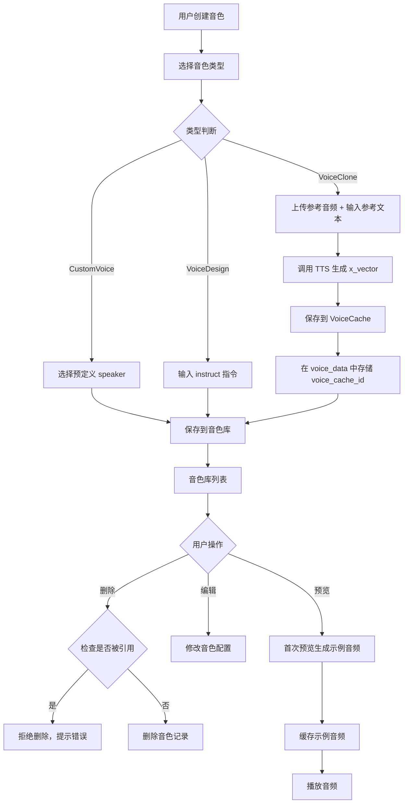

### 4.2 角色创建工作流程

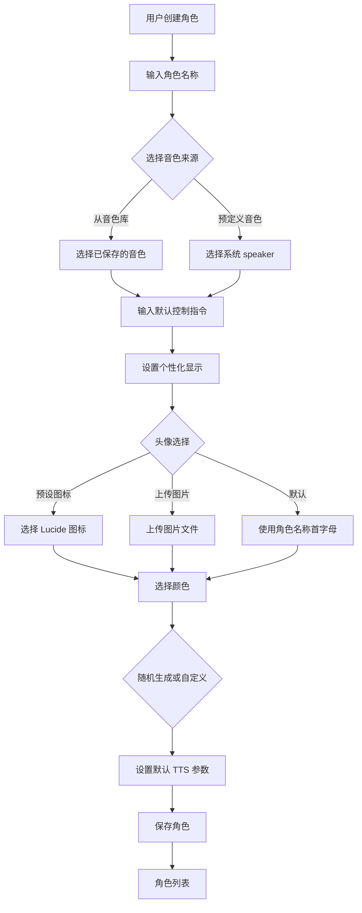

### 4.3 对话编辑和生成工作流程

#### 4.3.1 编辑阶段

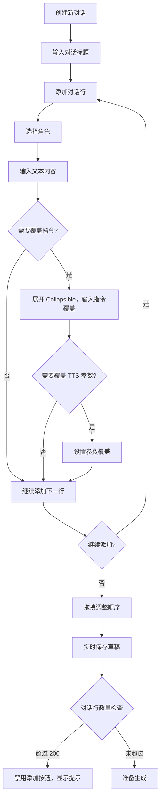

#### 4.3.2 顺序生成流程

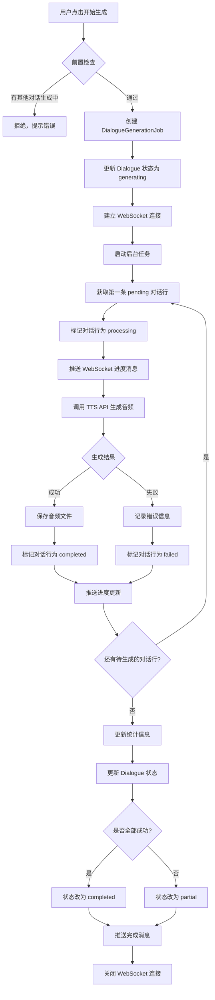

#### 4.3.3 暂停/继续流程

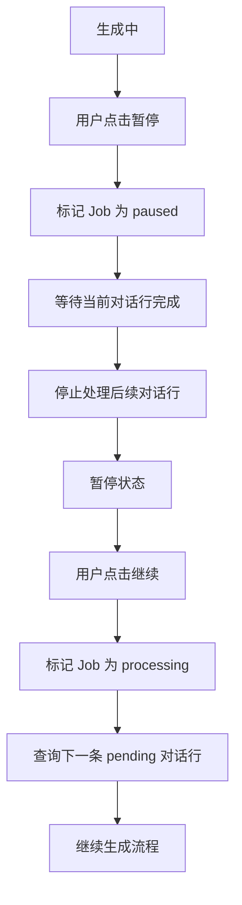

#### 4.3.4 取消生成流程

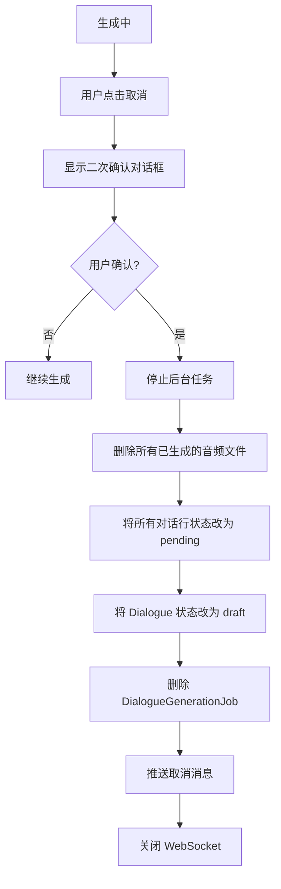

#### 4.3.5 批量生成流程

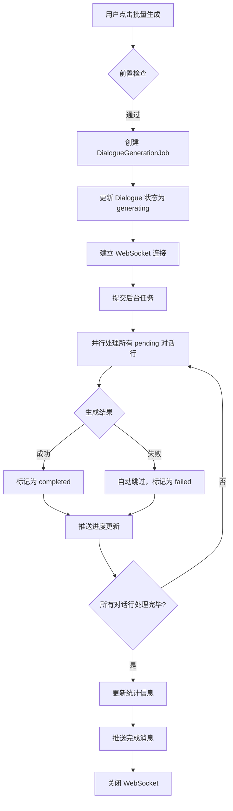

### 4.4 音频合并工作流程

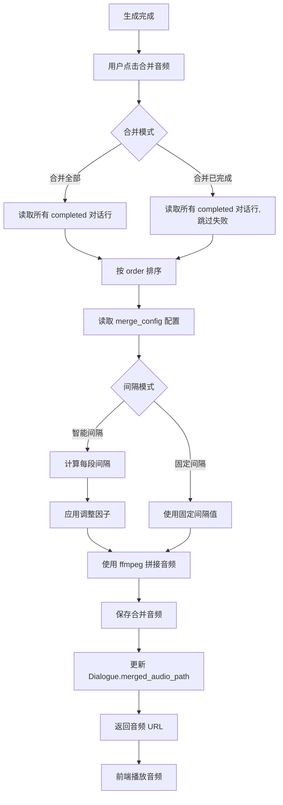

**智能间隔计算逻辑**:

```python
def calculate_interval(current_line, next_line, config):
    base = config["base_interval"]

    # 文本长度调整
    if len(current_line.text) < 20:
        base += config["short_text_adjust"]
    elif len(current_line.text) > 100:
        base += config["long_text_adjust"]

    # 角色切换调整
    if current_line.character_id == next_line.character_id:
        base += config["same_character_adjust"]
    else:
        base += config["different_character_adjust"]

    # 限制范围
    interval = max(config["min_interval"], min(base, config["max_interval"]))
    return interval
```

### 4.5 重新生成工作流程

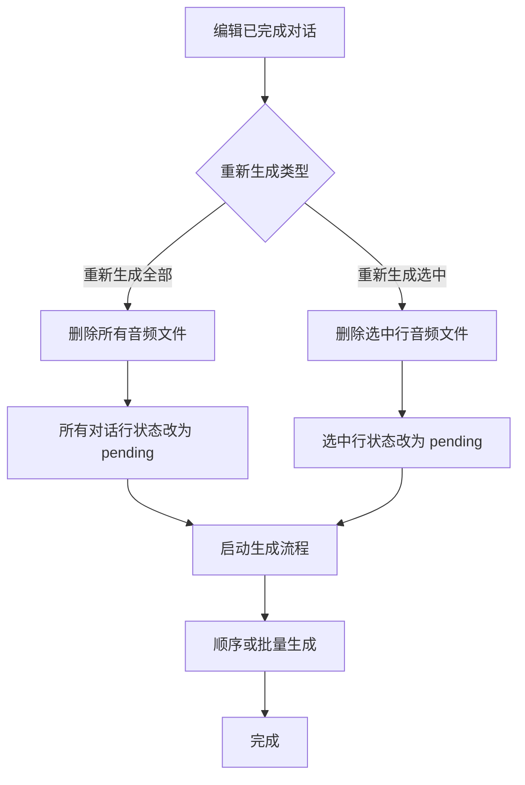

### 4.6 对话复制工作流程

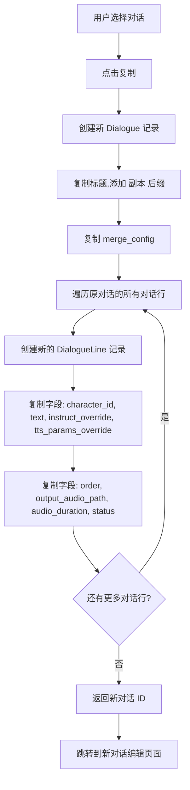

### 4.7 对话导出工作流程

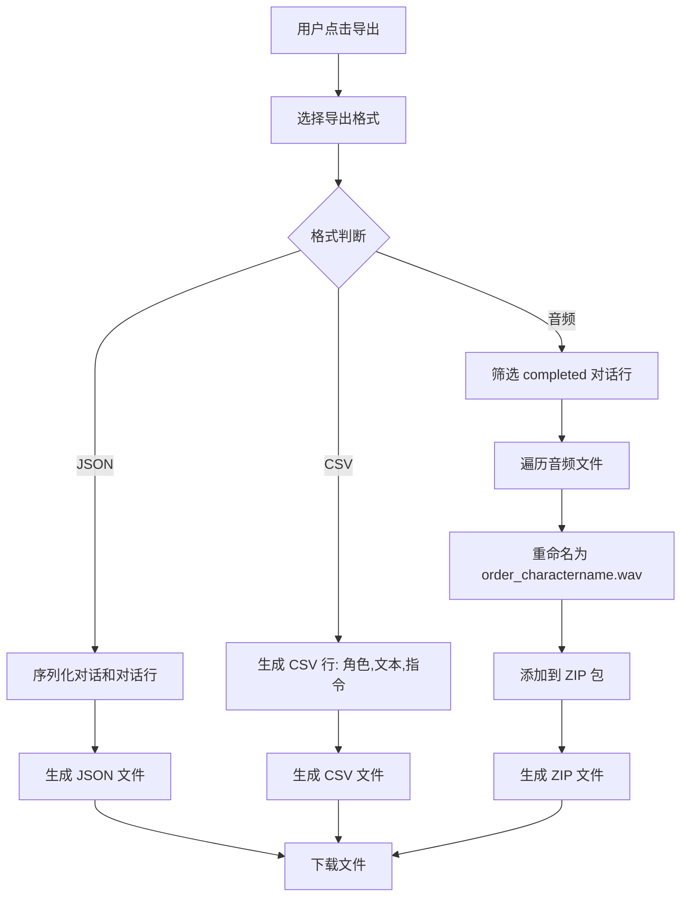

---

## 5. 技术实现细节

### 5.1 WebSocket 实时通信

#### 5.1.1 后端实现

**连接管理**:

```python
# api/ws.py
from fastapi import WebSocket, WebSocketDisconnect, Depends
from typing import Dict
import asyncio

class ConnectionManager:
    def __init__(self):
        self.active_connections: Dict[int, WebSocket] = {}

    async def connect(self, dialogue_id: int, websocket: WebSocket):
        await websocket.accept()
        self.active_connections[dialogue_id] = websocket

    def disconnect(self, dialogue_id: int):
        if dialogue_id in self.active_connections:
            del self.active_connections[dialogue_id]

    async def send_message(self, dialogue_id: int, message: dict):
        if dialogue_id in self.active_connections:
            websocket = self.active_connections[dialogue_id]
            await websocket.send_json(message)

manager = ConnectionManager()

@router.websocket("/ws/dialogue/{dialogue_id}/generate")
async def dialogue_generate_websocket(
    websocket: WebSocket,
    dialogue_id: int,
    token: str,
    db: Session = Depends(get_db)
):
    # 验证 token
    user = decode_access_token(token)
    if not user:
        await websocket.close(code=1008, reason="Unauthorized")
        return

    # 验证对话权限
    dialogue = get_dialogue(db, dialogue_id, user.id)
    if not dialogue:
        await websocket.close(code=1008, reason="Dialogue not found")
        return

    await manager.connect(dialogue_id, websocket)

    try:
        while True:
            # 保持连接，接收客户端消息（心跳等）
            data = await websocket.receive_text()
            # 可选：处理客户端消息
    except WebSocketDisconnect:
        manager.disconnect(dialogue_id)
```

**生成任务中推送进度**:

```python
# core/dialogue_generator.py
async def generate_dialogue_sequential(dialogue_id: int, user_id: int, db_url: str):
    db = SessionLocal()
    dialogue = get_dialogue(db, dialogue_id, user_id)
    lines = get_dialogue_lines(db, dialogue_id)

    total = len(lines)
    completed = 0
    failed = 0
    start_time = time.time()

    for line in lines:
        if line.status == "completed":
            completed += 1
            continue

        # 更新对话行状态
        update_line_status(db, line.id, "processing")

        # 推送进度
        elapsed = time.time() - start_time
        avg_time_per_line = elapsed / max(completed, 1)
        remaining_lines = total - completed - failed
        estimated_remaining = int(avg_time_per_line * remaining_lines)

        await manager.send_message(dialogue_id, {
            "type": "dialogue_progress",
            "data": {
                "dialogue_id": dialogue_id,
                "current_line_id": line.id,
                "current_line_order": line.order,
                "total_lines": total,
                "completed_lines": completed,
                "failed_lines": failed,
                "line_status": "processing",
                "estimated_remaining_seconds": estimated_remaining
            }
        })

        try:
            # 调用 TTS 生成
            audio_path = await generate_line_audio(db, line)

            # 更新对话行
            update_line_status(db, line.id, "completed", output_audio_path=audio_path)
            completed += 1

            # 推送完成
            await manager.send_message(dialogue_id, {
                "type": "dialogue_progress",
                "data": {
                    "dialogue_id": dialogue_id,
                    "current_line_id": line.id,
                    "line_status": "completed",
                    "audio_url": f"/api/dialogues/{dialogue_id}/lines/{line.id}/audio",
                    "audio_duration": get_audio_duration(audio_path)
                }
            })

        except Exception as e:
            # 记录错误
            update_line_status(db, line.id, "failed", error_message=str(e))
            failed += 1

            # 推送错误
            await manager.send_message(dialogue_id, {
                "type": "dialogue_error",
                "data": {
                    "dialogue_id": dialogue_id,
                    "line_id": line.id,
                    "error_message": str(e)
                }
            })

    # 更新对话状态
    status = "completed" if failed == 0 else "partial"
    update_dialogue_status(db, dialogue_id, status, success_count=completed, failed_count=failed)

    # 推送完成
    await manager.send_message(dialogue_id, {
        "type": "dialogue_completed",
        "data": {
            "dialogue_id": dialogue_id,
            "status": status,
            "total_lines": total,
            "success_count": completed,
            "failed_count": failed
        }
    })

    db.close()
```

#### 5.1.2 前端实现

**WebSocket Hook**:

```typescript
// hooks/useDialogueWebSocket.ts
import { useEffect, useRef, useState, useCallback } from 'react'
import { useAuth } from '@/contexts/AuthContext'

interface WebSocketMessage {
  type: 'dialogue_progress' | 'dialogue_completed' | 'dialogue_error' | 'dialogue_cancelled'
  data: any
}

interface UseDialogueWebSocketOptions {
  dialogueId: number
  onProgress?: (data: any) => void
  onCompleted?: (data: any) => void
  onError?: (data: any) => void
  onCancelled?: (data: any) => void
}

export function useDialogueWebSocket({
  dialogueId,
  onProgress,
  onCompleted,
  onError,
  onCancelled
}: UseDialogueWebSocketOptions) {
  const { token } = useAuth()
  const wsRef = useRef<WebSocket | null>(null)
  const [isConnected, setIsConnected] = useState(false)
  const [isReconnecting, setIsReconnecting] = useState(false)
  const reconnectTimeoutRef = useRef<NodeJS.Timeout>()
  const reconnectAttemptsRef = useRef(0)
  const maxReconnectAttempts = 10

  const connect = useCallback(() => {
    if (!token) return

    const wsUrl = `ws://localhost:8000/api/ws/dialogue/${dialogueId}/generate?token=${token}`
    const ws = new WebSocket(wsUrl)

    ws.onopen = () => {
      console.log('WebSocket connected')
      setIsConnected(true)
      setIsReconnecting(false)
      reconnectAttemptsRef.current = 0
    }

    ws.onmessage = (event) => {
      const message: WebSocketMessage = JSON.parse(event.data)

      switch (message.type) {
        case 'dialogue_progress':
          onProgress?.(message.data)
          break
        case 'dialogue_completed':
          onCompleted?.(message.data)
          break
        case 'dialogue_error':
          onError?.(message.data)
          break
        case 'dialogue_cancelled':
          onCancelled?.(message.data)
          break
      }
    }

    ws.onerror = (error) => {
      console.error('WebSocket error:', error)
    }

    ws.onclose = () => {
      console.log('WebSocket disconnected')
      setIsConnected(false)

      // 自动重连
      if (reconnectAttemptsRef.current < maxReconnectAttempts) {
        setIsReconnecting(true)
        reconnectAttemptsRef.current += 1
        reconnectTimeoutRef.current = setTimeout(() => {
          console.log(`Reconnecting... (attempt ${reconnectAttemptsRef.current})`)
          connect()
        }, 3000)
      }
    }

    wsRef.current = ws
  }, [dialogueId, token, onProgress, onCompleted, onError, onCancelled])

  const disconnect = useCallback(() => {
    if (reconnectTimeoutRef.current) {
      clearTimeout(reconnectTimeoutRef.current)
    }
    if (wsRef.current) {
      wsRef.current.close()
      wsRef.current = null
    }
    setIsConnected(false)
    setIsReconnecting(false)
  }, [])

  useEffect(() => {
    connect()
    return () => disconnect()
  }, [connect, disconnect])

  return { isConnected, isReconnecting, disconnect }
}
```

**在 DialogueContext 中使用**:

```typescript
// contexts/DialogueContext.tsx
const { isConnected, isReconnecting } = useDialogueWebSocket({
  dialogueId: currentDialogue?.id || 0,
  onProgress: (data) => {
    // 更新进度状态
    setGenerationProgress({
      current: data.current_line_order,
      total: data.total_lines,
      completed: data.completed_lines,
      failed: data.failed_lines,
      estimatedRemaining: data.estimated_remaining_seconds
    })

    // 更新对话行状态
    updateLineInState(data.current_line_id, {
      status: data.line_status,
      output_audio_path: data.audio_url,
      audio_duration: data.audio_duration
    })
  },
  onCompleted: (data) => {
    setIsGenerating(false)
    updateDialogueInState({ status: data.status })
    toast.success('对话生成完成！')
  },
  onError: (data) => {
    updateLineInState(data.line_id, {
      status: 'failed',
      error_message: data.error_message
    })
    toast.error(`对话行 ${data.line_id} 生成失败`)
  },
  onCancelled: () => {
    setIsGenerating(false)
    toast.info('生成已取消')
  }
})
```

---

### 5.2 虚拟滚动实现

使用 `@tanstack/react-virtual` 实现表格虚拟滚动，优化大列表性能。

```typescript
// components/dialogues/DialogueTable.tsx
import { useVirtualizer } from '@tanstack/react-virtual'
import { useRef } from 'react'

export function DialogueTable({ lines }: { lines: DialogueLine[] }) {
  const parentRef = useRef<HTMLDivElement>(null)

  const rowVirtualizer = useVirtualizer({
    count: lines.length,
    getScrollElement: () => parentRef.current,
    estimateSize: () => 60,  // 预估行高
    overscan: 5  // 预渲染5行
  })

  return (
    <div ref={parentRef} className="h-[600px] overflow-auto">
      <div
        style={{
          height: `${rowVirtualizer.getTotalSize()}px`,
          width: '100%',
          position: 'relative'
        }}
      >
        {rowVirtualizer.getVirtualItems().map((virtualRow) => {
          const line = lines[virtualRow.index]
          return (
            <div
              key={line.id}
              style={{
                position: 'absolute',
                top: 0,
                left: 0,
                width: '100%',
                height: `${virtualRow.size}px`,
                transform: `translateY(${virtualRow.start}px)`
              }}
            >
              <DialogueLineRow line={line} />
            </div>
          )
        })}
      </div>
    </div>
  )
}
```

---

### 5.3 撤销/重做功能

实现编辑操作的撤销和重做。

```typescript
// hooks/useUndoRedo.ts
import { useState, useCallback } from 'react'

interface HistoryState<T> {
  past: T[]
  present: T
  future: T[]
}

export function useUndoRedo<T>(initialState: T) {
  const [state, setState] = useState<HistoryState<T>>({
    past: [],
    present: initialState,
    future: []
  })

  const set = useCallback((newPresent: T) => {
    setState((currentState) => ({
      past: [...currentState.past, currentState.present],
      present: newPresent,
      future: []
    }))
  }, [])

  const undo = useCallback(() => {
    setState((currentState) => {
      if (currentState.past.length === 0) return currentState

      const previous = currentState.past[currentState.past.length - 1]
      const newPast = currentState.past.slice(0, currentState.past.length - 1)

      return {
        past: newPast,
        present: previous,
        future: [currentState.present, ...currentState.future]
      }
    })
  }, [])

  const redo = useCallback(() => {
    setState((currentState) => {
      if (currentState.future.length === 0) return currentState

      const next = currentState.future[0]
      const newFuture = currentState.future.slice(1)

      return {
        past: [...currentState.past, currentState.present],
        present: next,
        future: newFuture
      }
    })
  }, [])

  const canUndo = state.past.length > 0
  const canRedo = state.future.length > 0

  return {
    state: state.present,
    set,
    undo,
    redo,
    canUndo,
    canRedo
  }
}
```

**在 DialogueContext 中集成**:

```typescript
const {
  state: lines,
  set: setLines,
  undo,
  redo,
  canUndo,
  canRedo
} = useUndoRedo<DialogueLine[]>([])

// 在 addLine, updateLine, deleteLine, reorderLines 时调用 setLines
```

---

### 5.4 快捷键实现

```typescript
// hooks/useKeyboardShortcuts.ts
import { useEffect } from 'react'

interface KeyboardShortcut {
  key: string
  ctrl?: boolean
  shift?: boolean
  handler: () => void
}

export function useKeyboardShortcuts(shortcuts: KeyboardShortcut[]) {
  useEffect(() => {
    const handleKeyDown = (e: KeyboardEvent) => {
      for (const shortcut of shortcuts) {
        const ctrlMatch = shortcut.ctrl === undefined || shortcut.ctrl === e.ctrlKey
        const shiftMatch = shortcut.shift === undefined || shortcut.shift === e.shiftKey
        const keyMatch = e.key === shortcut.key

        if (ctrlMatch && shiftMatch && keyMatch) {
          e.preventDefault()
          shortcut.handler()
          break
        }
      }
    }

    window.addEventListener('keydown', handleKeyDown)
    return () => window.removeEventListener('keydown', handleKeyDown)
  }, [shortcuts])
}
```

**在 DialogueEditor 中使用**:

```typescript
useKeyboardShortcuts([
  { key: 'Enter', handler: () => addLine() },
  { key: 'd', ctrl: true, handler: () => deleteCurrentLine() },
  { key: 'ArrowUp', ctrl: true, handler: () => moveLineUp() },
  { key: 'ArrowDown', ctrl: true, handler: () => moveLineDown() },
  { key: 'z', ctrl: true, handler: () => undo() },
  { key: 'z', ctrl: true, shift: true, handler: () => redo() }
])
```

---

### 5.5 音频合并实现

**后端使用 ffmpeg**:

```python
# core/audio_merger.py
import subprocess
from pathlib import Path

def merge_audio_files(
    audio_paths: list[str],
    intervals: list[float],
    output_path: str
) -> str:
    """
    使用 ffmpeg 合并音频文件，添加间隔

    Args:
        audio_paths: 音频文件路径列表
        intervals: 间隔时间列表（秒），长度为 len(audio_paths) - 1
        output_path: 输出文件路径

    Returns:
        输出文件路径
    """
    # 创建临时文件列表
    temp_files = []

    for i, audio_path in enumerate(audio_paths):
        temp_files.append(audio_path)

        # 最后一个文件后不需要间隔
        if i < len(audio_paths) - 1:
            # 生成静音文件
            silence_path = f"/tmp/silence_{i}.wav"
            duration = intervals[i]
            subprocess.run([
                'ffmpeg', '-y',
                '-f', 'lavfi',
                '-i', f'anullsrc=r=24000:cl=mono',
                '-t', str(duration),
                silence_path
            ], check=True)
            temp_files.append(silence_path)

    # 创建 concat 文件列表
    concat_file = "/tmp/concat_list.txt"
    with open(concat_file, 'w') as f:
        for temp_file in temp_files:
            f.write(f"file '{temp_file}'\n")

    # 合并音频
    subprocess.run([
        'ffmpeg', '-y',
        '-f', 'concat',
        '-safe', '0',
        '-i', concat_file,
        '-c', 'copy',
        output_path
    ], check=True)

    # 清理临时文件
    for temp_file in temp_files:
        if temp_file.startswith('/tmp/silence_'):
            Path(temp_file).unlink(missing_ok=True)
    Path(concat_file).unlink(missing_ok=True)

    return output_path
```

---

### 5.6 权限验证装饰器

统一的权限验证模式：

```python
# api/dependencies.py
from fastapi import HTTPException, Depends, status
from sqlalchemy.orm import Session

def verify_voice_library_access(
    voice_id: int,
    current_user: User = Depends(get_current_user),
    db: Session = Depends(get_db)
) -> VoiceLibrary:
    """验证用户对音色库的访问权限"""
    voice = get_voice_library(db, voice_id, current_user.id)
    if not voice:
        raise HTTPException(
            status_code=status.HTTP_404_NOT_FOUND,
            detail="音色不存在或无权访问"
        )
    return voice

def verify_character_access(
    character_id: int,
    current_user: User = Depends(get_current_user),
    db: Session = Depends(get_db)
) -> Character:
    """验证用户对角色的访问权限"""
    character = get_character(db, character_id, current_user.id)
    if not character:
        raise HTTPException(
            status_code=status.HTTP_404_NOT_FOUND,
            detail="角色不存在或无权访问"
        )
    return character

def verify_dialogue_access(
    dialogue_id: int,
    current_user: User = Depends(get_current_user),
    db: Session = Depends(get_db)
) -> Dialogue:
    """验证用户对对话的访问权限"""
    dialogue = get_dialogue(db, dialogue_id, current_user.id)
    if not dialogue:
        raise HTTPException(
            status_code=status.HTTP_404_NOT_FOUND,
            detail="对话不存在或无权访问"
        )
    return dialogue
```

**在 API 端点中使用**:

```python
@router.delete("/voices/{voice_id}")
async def delete_voice(
    voice: VoiceLibrary = Depends(verify_voice_library_access),
    db: Session = Depends(get_db)
):
    # 检查是否被角色引用
    character_count = db.query(Character).filter(
        Character.voice_library_id == voice.id
    ).count()

    if character_count > 0:
        raise HTTPException(
            status_code=status.HTTP_400_BAD_REQUEST,
            detail=f"该音色正在被 {character_count} 个角色使用，无法删除"
        )

    # 删除音色
    delete_voice_library(db, voice.id)

    # 删除示例音频文件
    if voice.preview_audio_path:
        Path(voice.preview_audio_path).unlink(missing_ok=True)

    return {"message": "删除成功"}
```

---

### 5.7 预设数据初始化

**系统启动时初始化预设数据**:

```python
# core/init_data.py
PREDEFINED_TAGS = {
    "voice_library": [
        "男声", "女声", "童声",
        "温柔", "有力", "沉稳", "活泼",
        "播音", "对话", "情感", "旁白"
    ],
    "character": [
        "主角", "配角", "旁白",
        "正面", "反面", "中立"
    ]
}

PREDEFINED_ICONS = [
    "user", "user-circle", "user-round",
    "mic", "volume-2", "headphones",
    "smile", "meh", "frown"
]

EXAMPLE_TEXTS = {
    "zh": "这是一段示例音频，用于预览音色效果。",
    "en": "This is a sample audio for voice preview.",
    "ja": "これはボイスプレビュー用のサンプル音声です。",
    "ko": "이것은 음성 미리보기를 위한 샘플 오디오입니다。"
}

def init_predefined_data():
    """应用启动时调用，初始化预设数据"""
    # 存储在应用配置中，不需要写入数据库
    app.state.predefined_tags = PREDEFINED_TAGS
    app.state.predefined_icons = PREDEFINED_ICONS
    app.state.example_texts = EXAMPLE_TEXTS
```

**在 main.py 中调用**:

```python
@app.on_event("startup")
async def startup_event():
    init_predefined_data()
    print("Predefined data initialized")
```

---

## 6. 配置和环境变量

### 6.1 新增环境变量

在 `.env` 文件中添加：

```bash
# 音色库音频存储目录
VOICE_LIBRARY_OUTPUT_DIR=./outputs/voice-library

# 对话音频存储目录
DIALOGUES_OUTPUT_DIR=./outputs/dialogues

# WebSocket 连接配置（可选）
WEBSOCKET_PING_INTERVAL=30
WEBSOCKET_PING_TIMEOUT=10
```

### 6.2 配置文件更新

在 `config.py` 中添加：

```python
# config.py
from pydantic_settings import BaseSettings
from pathlib import Path

class Settings(BaseSettings):
    # 现有配置...

    # 音色库配置
    VOICE_LIBRARY_OUTPUT_DIR: str = "./outputs/voice-library"

    # 对话配置
    DIALOGUES_OUTPUT_DIR: str = "./outputs/dialogues"
    MAX_DIALOGUE_LINES: int = 200

    # WebSocket 配置
    WEBSOCKET_PING_INTERVAL: int = 30
    WEBSOCKET_PING_TIMEOUT: int = 10

    class Config:
        env_file = ".env"

settings = Settings()

# 确保输出目录存在
Path(settings.VOICE_LIBRARY_OUTPUT_DIR).mkdir(parents=True, exist_ok=True)
Path(settings.DIALOGUES_OUTPUT_DIR).mkdir(parents=True, exist_ok=True)
```

### 6.3 音频文件命名规范

**音色库示例音频**:

```
./outputs/voice-library/voice_{voice_id}_preview_{timestamp}.wav
```

示例:
```
./outputs/voice-library/voice_1_preview_20240101120000.wav
```

**对话行音频**:

```
./outputs/dialogues/dialogue_{dialogue_id}_line_{line_id}_{timestamp}.wav
```

示例:
```
./outputs/dialogues/dialogue_1_line_5_20240101120000.wav
```

**合并音频**:

```
./outputs/dialogues/dialogue_{dialogue_id}_merged_{timestamp}.wav
```

示例:
```
./outputs/dialogues/dialogue_1_merged_20240101120000.wav
```

---

## 7. 验收标准

### 7.1 功能验收

#### 音色库管理
- [x] 用户可以创建三种类型的音色（CustomVoice, VoiceDesign, VoiceClone）
- [x] 用户可以编辑和删除音色
- [x] 删除音色时，如果被角色引用，显示错误提示
- [x] 用户可以预览音色（首次生成并缓存）
- [x] 用户可以使用标签筛选音色
- [x] 音色库列表支持分页（每页10条）

#### 角色管理
- [x] 用户可以创建角色，选择音色来源（音色库 或 预定义speaker）
- [x] 用户可以设置角色的头像（预设图标/上传图片）和颜色
- [x] 用户可以编辑和删除角色
- [x] 删除角色时，如果被对话使用，显示错误提示
- [x] 用户可以预览角色音色
- [x] 角色列表支持分页（每页10条）

#### 对话编辑
- [x] 用户可以创建新对话，设置标题和合并配置
- [x] 用户可以添加对话行，选择角色、输入文本
- [x] 用户可以展开对话行，覆盖控制指令和 TTS 参数
- [x] 用户可以拖拽调整对话行顺序
- [x] 用户可以编辑和删除对话行
- [x] 对话行数量达到 200 条时，禁用添加按钮并提示
- [x] 对话编辑器支持虚拟滚动，流畅渲染大列表
- [x] 支持快捷键（Enter, Ctrl+D, Ctrl+↑/↓, Ctrl+Z）
- [x] 修改后立即保存（debounce 300ms）

#### 对话生成
- [x] 用户可以选择顺序生成或批量生成模式
- [x] 顺序生成通过 WebSocket 实时显示进度
- [x] 用户可以暂停和继续顺序生成
- [x] 用户可以取消生成（需二次确认，删除所有音频）
- [x] 单条对话行失败时，显示错误信息并支持重试
- [x] 生成完成后，显示成功/失败统计
- [x] 同一用户同时只能有一个对话在生成中
- [x] WebSocket 连接断开时自动重连

#### 音频合并
- [x] 用户可以选择"合并全部"或"合并已完成"
- [x] 系统根据 merge_config 计算智能间隔
- [x] 用户可以调整合并配置（基础间隔、调整因子）
- [x] 合并完成后，提供下载链接

#### 重新生成
- [x] 用户可以重新生成全部对话行
- [x] 用户可以选择部分对话行重新生成
- [x] 重新生成时删除旧音频，更新时间戳

#### 对话管理
- [x] 用户可以查看对话历史列表（每页20条，无限滚动）
- [x] 用户可以复制对话（包含音频和状态）
- [x] 用户可以导出对话（JSON/CSV/音频ZIP）
- [x] 用户可以批量删除对话

### 7.2 性能验收

- [x] 音色库列表加载时间 < 1秒
- [x] 角色列表加载时间 < 1秒
- [x] 对话历史列表加载时间 < 1秒
- [x] 对话编辑器支持 200 条对话行流畅编辑
- [x] 虚拟滚动渲染性能良好（60fps）
- [x] 音频合并时间 < 5秒（200条以内）
- [x] WebSocket 消息延迟 < 100ms

### 7.3 用户体验验收

- [x] 界面布局清晰，三栏布局合理
- [x] 移动端适配良好（左侧 Sheet，右侧隐藏，中间全屏）
- [x] 表格拖拽排序流畅自然
- [x] 加载状态、错误状态、空状态显示清晰
- [x] 只在错误时显示 toast 提示
- [x] 删除操作需要二次确认
- [x] 快捷键工作正常
- [x] 颜色选择器易用
- [x] 音色和角色预览功能正常

### 7.4 数据安全验收

- [x] 所有数据按用户隔离，用户只能访问自己的数据
- [x] API 端点正确验证用户权限
- [x] 跨表查询验证所有相关资源权限
- [x] 级联删除检查正确实施
- [x] 文件访问权限验证
- [x] WebSocket 连接需要 token 认证

### 7.5 错误处理验收

- [x] 音色删除失败时，显示被引用的角色数量
- [x] 角色删除失败时，显示被引用的对话数量
- [x] 对话行超过 200 条时，显示提示并禁用添加
- [x] 用户有生成中的对话时，拒绝新的生成请求并提示
- [x] WebSocket 连接失败时，自动重连并显示状态
- [x] TTS 生成失败时，记录详细错误信息并支持重试
- [x] 文件操作失败时，显示清晰的错误提示

---

## 8. 开发建议

### 8.1 开发顺序

**Phase 1: 数据层和 API**
1. 创建数据模型（VoiceLibrary, Character, Dialogue, DialogueLine, DialogueGenerationJob）
2. 实现 CRUD API（音色库、角色、对话、对话行）
3. 实现权限验证和删除检查
4. 编写单元测试

**Phase 2: 音色库和角色管理**
1. 实现音色库前端页面（列表、创建/编辑对话框、预览）
2. 实现角色管理前端页面（列表、创建/编辑对话框、预览）
3. 集成到对话编辑器右侧 Tabs

**Phase 3: 对话编辑器**
1. 实现对话历史列表（左侧边栏）
2. 实现对话标题编辑区
3. 实现表格式对话编辑器（基础版，不含拖拽和虚拟滚动）
4. 实现对话行的添加、编辑、删除
5. 实现快捷键支持
6. 实现撤销/重做功能

**Phase 4: 对话生成**
1. 实现 WebSocket 后端（连接管理、消息推送）
2. 实现顺序生成后台任务
3. 实现 WebSocket 前端 Hook
4. 集成生成控制面板
5. 实现暂停/继续/取消功能
6. 实现单条重试功能

**Phase 5: 优化和高级功能**
1. 实现虚拟滚动优化
2. 实现拖拽排序（react-beautiful-dnd）
3. 实现音频合并功能
4. 实现批量生成模式
5. 实现重新生成功能
6. 实现对话复制功能
7. 实现导出功能

**Phase 6: 测试和优化**
1. 性能测试和优化
2. 移动端适配测试
3. 边界情况测试
4. 用户体验优化

### 8.2 注意事项

1. **数据一致性**: 确保对话行的 order 字段在拖拽、删除后保持连续
2. **文件清理**: 删除对话、对话行、音色时，记得清理关联的音频文件
3. **并发控制**: 同一用户只能有一个生成中的对话，需要在 API 层验证
4. **WebSocket 稳定性**: 实现心跳机制，处理断线重连
5. **虚拟滚动兼容性**: 确保拖拽排序在虚拟滚动下正常工作
6. **权限验证**: 所有 API 端点都要验证用户权限，避免越权访问
7. **错误提示**: 提供清晰的错误提示，帮助用户理解问题和解决方法
8. **性能监控**: 大列表、长时间生成任务需要监控性能指标

---

## 附录

### A. 数据模型 SQL 定义

```sql
-- VoiceLibrary
CREATE TABLE voice_libraries (
    id INTEGER PRIMARY KEY AUTOINCREMENT,
    user_id INTEGER NOT NULL,
    name TEXT NOT NULL,
    description TEXT,
    voice_type TEXT NOT NULL,
    voice_data TEXT NOT NULL,  -- JSON
    tags TEXT NOT NULL,  -- JSON array
    preview_audio_path TEXT,
    created_at DATETIME NOT NULL,
    last_used_at DATETIME,
    usage_count INTEGER DEFAULT 0,
    FOREIGN KEY (user_id) REFERENCES users(id) ON DELETE CASCADE
);
CREATE INDEX idx_user_voice_library ON voice_libraries(user_id, created_at);

-- Character
CREATE TABLE characters (
    id INTEGER PRIMARY KEY AUTOINCREMENT,
    user_id INTEGER NOT NULL,
    name TEXT NOT NULL,
    description TEXT,
    voice_source_type TEXT NOT NULL,
    voice_library_id INTEGER,
    preset_speaker TEXT,
    default_instruct TEXT,
    avatar_type TEXT NOT NULL,
    avatar_data TEXT,
    color TEXT NOT NULL,
    tags TEXT NOT NULL,  -- JSON array
    default_tts_params TEXT,  -- JSON
    created_at DATETIME NOT NULL,
    last_used_at DATETIME,
    FOREIGN KEY (user_id) REFERENCES users(id) ON DELETE CASCADE,
    FOREIGN KEY (voice_library_id) REFERENCES voice_libraries(id) ON DELETE RESTRICT
);
CREATE INDEX idx_user_character ON characters(user_id, created_at);

-- Dialogue
CREATE TABLE dialogues (
    id INTEGER PRIMARY KEY AUTOINCREMENT,
    user_id INTEGER NOT NULL,
    title TEXT NOT NULL,
    status TEXT NOT NULL,
    generation_mode TEXT NOT NULL,
    merge_config TEXT NOT NULL,  -- JSON
    total_lines INTEGER DEFAULT 0,
    success_count INTEGER DEFAULT 0,
    failed_count INTEGER DEFAULT 0,
    created_at DATETIME NOT NULL,
    updated_at DATETIME NOT NULL,
    completed_at DATETIME,
    merged_audio_path TEXT,
    FOREIGN KEY (user_id) REFERENCES users(id) ON DELETE CASCADE
);
CREATE INDEX idx_user_dialogue_status ON dialogues(user_id, status);
CREATE INDEX idx_user_dialogue_created ON dialogues(user_id, created_at);

-- DialogueLine
CREATE TABLE dialogue_lines (
    id INTEGER PRIMARY KEY AUTOINCREMENT,
    dialogue_id INTEGER NOT NULL,
    character_id INTEGER NOT NULL,
    "order" INTEGER NOT NULL,
    text TEXT NOT NULL,
    instruct_override TEXT,
    tts_params_override TEXT,  -- JSON
    status TEXT NOT NULL,
    output_audio_path TEXT,
    audio_duration REAL,
    error_message TEXT,
    retry_count INTEGER DEFAULT 0,
    created_at DATETIME NOT NULL,
    updated_at DATETIME NOT NULL,
    completed_at DATETIME,
    FOREIGN KEY (dialogue_id) REFERENCES dialogues(id) ON DELETE CASCADE,
    FOREIGN KEY (character_id) REFERENCES characters(id) ON DELETE RESTRICT
);
CREATE INDEX idx_dialogue_line_order ON dialogue_lines(dialogue_id, "order");
CREATE INDEX idx_dialogue_line_status ON dialogue_lines(dialogue_id, status);

-- DialogueGenerationJob
CREATE TABLE dialogue_generation_jobs (
    id INTEGER PRIMARY KEY AUTOINCREMENT,
    dialogue_id INTEGER NOT NULL,
    user_id INTEGER NOT NULL,
    job_type TEXT NOT NULL,
    status TEXT NOT NULL,
    current_line_id INTEGER,
    total_lines INTEGER NOT NULL,
    completed_lines INTEGER DEFAULT 0,
    failed_lines INTEGER DEFAULT 0,
    error_message TEXT,
    created_at DATETIME NOT NULL,
    started_at DATETIME,
    completed_at DATETIME,
    FOREIGN KEY (dialogue_id) REFERENCES dialogues(id) ON DELETE CASCADE,
    FOREIGN KEY (user_id) REFERENCES users(id) ON DELETE CASCADE
);
CREATE INDEX idx_user_job_status ON dialogue_generation_jobs(user_id, status);
CREATE INDEX idx_dialogue_job ON dialogue_generation_jobs(dialogue_id);
```

### B. 前端依赖包清单

```json
{
  "dependencies": {
    "react": "^19.0.0",
    "react-dom": "^19.0.0",
    "react-router-dom": "^7.0.0",
    "@tanstack/react-virtual": "^3.0.0",
    "react-beautiful-dnd": "^13.1.1",
    "react-hook-form": "^7.49.0",
    "zod": "^3.22.4",
    "@hookform/resolvers": "^3.3.2",
    "axios": "^1.6.0",
    "clsx": "^2.1.0",
    "tailwind-merge": "^2.2.0",
    "lucide-react": "^0.300.0",
    "@radix-ui/react-dialog": "^1.0.5",
    "@radix-ui/react-tabs": "^1.0.4",
    "@radix-ui/react-collapsible": "^1.0.3",
    "@radix-ui/react-progress": "^1.0.3",
    "@radix-ui/react-select": "^2.0.0",
    "sonner": "^1.3.0"
  }
}
```

---

**文档版本**: 1.0
**最后更新**: 2024-01-26
**作者**: Claude (AI Assistant) + 项目团队
